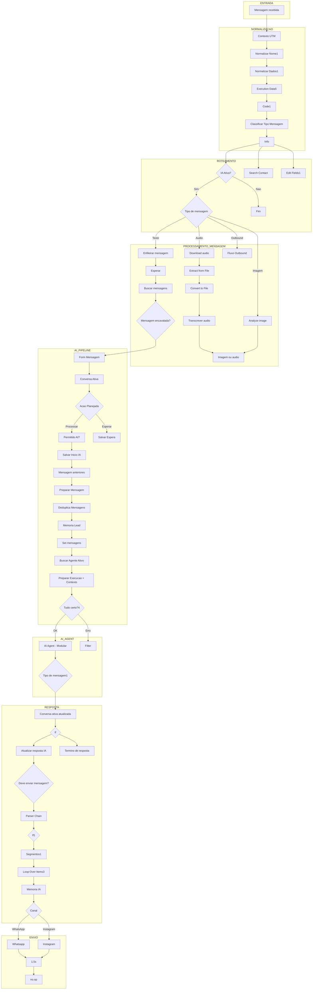

# INVENTARIO ESTRUTURAL COMPLETO
## Workflow: GHL - Mottivme - EUA Versionado

**Data de Analise:** 2025-12-31
**Arquivo Fonte:** `GHL - Mottivme - EUA Versionado.json`
**Agente Responsavel:** Agente 1 - Especialista em Analise Estrutural

---

## 1. RESUMO EXECUTIVO

### 1.1 Metricas Gerais

| Metrica | Valor |
|---------|-------|
| **Total de Nos** | 115 |
| **Nos Ativos** | 111 |
| **Nos Desabilitados** | 4 |
| **Tipos de Nos Distintos** | 27 |
| **Total de Credenciais** | 6 |
| **Complexidade Geral** | **ALTA** |

### 1.2 Classificacao de Complexidade

Este workflow e classificado como **ALTA COMPLEXIDADE** devido a:
- 115 nos totais (considerado grande)
- 20 nos Postgres (multiplas operacoes de banco)
- 16 nos HTTP Request (alta integracao externa)
- 15 nos Code (logica customizada extensa)
- 7 nos Switch (multiplos branches de decisao)
- Integracao com AI Agent modular com 7 tools
- Pipeline de processamento de audio/imagem

### 1.3 Entry Points (Triggers)

| No | Tipo | ID |
|----|------|-----|
| Mensagem recebida | Webhook | `8b088c6c-3506-4bb1-98e1-8549cf75152a` |

**Observacao:** Os nos de Tool (Langchain) tambem sao entry points tecnicos mas sao sub-componentes do AI Agent.

### 1.4 Exit Points (Finais do Fluxo)

| No | Funcao |
|----|--------|
| Call Track AI Cost | Rastrear custos de AI |
| Postgres | Salvar metricas de execucao |
| Salvar registro de Atividade - alan | Log de atividade |
| Salvar registro de Atividade - marcos | Log de atividade |
| historico_mensagens_leads | Persistir historico |
| 5 Atualizar Carreira | Atualizar contato GHL |
| 5 Atualizar Consultoria | Atualizar contato GHL |
| 5 Perguntar Objetivo (SMS) | Enviar mensagem |
| Update Contact (Outbound)2 | Atualizar contato |
| Instagram4 | Enviar mensagem Instagram |
| Edit Fields2 | Transformacao de dados |

---

## 2. INVENTARIO POR TIPO

### 2.1 Distribuicao por Categoria

```
POSTGRES              ████████████████████ 20 (17.4%)
HTTP REQUEST          ████████████████ 16 (13.9%)
CODE                  ███████████████ 15 (13.0%)
STICKY NOTE           █████████████ 13 (11.3%)
SET                   ████████ 8 (7.0%)
SWITCH                ███████ 7 (6.1%)
LANGCHAIN TOOLS       █████ 5 (4.3%)
EXECUTION DATA        ████ 4 (3.5%)
IF                    ████ 4 (3.5%)
FILTER                ███ 3 (2.6%)
WAIT                  ███ 3 (2.6%)
OUTROS                ████████████████ 17 (14.8%)
```

---

### 2.2 Nos Postgres (20 nos)

| ID | Nome | Operacao | Tabela/Query |
|----|------|----------|--------------|
| `780b94b3-7962-4315-b4c4-a5a0aa8b4288` | Postgres | executeQuery | execution_metrics |
| `58dd5b6d-7ffb-4940-a292-ba80a8914483` | Buscar mensagens | select | fila de mensagens |
| `c6b038d8-871b-4709-bf26-8d808d29158a` | Limpar fila de mensagens | deleteTable | fila |
| `d228bdf9-3c9e-46d4-afd2-1ab1fad665e5` | Enfileirar mensagem | insert/upsert | fila |
| `d8560446-bfd9-42a2-b4eb-a2925c88b0fc` | Conversa Ativa | select | conversas |
| `f89511d6-39fc-413d-ac7c-5fe9fa0bb18f` | Salvar Espera | upsert | estado espera |
| `3131af47-bee4-4e87-bf03-a313cef4b730` | Conversa ativa atualizada | select | conversas |
| `90a128fb-e7ae-4c56-88f3-150d149ddb80` | Termino de resposta | deleteTable | fila |
| `d5c47233-8e95-493c-a144-3e3c4dd56d89` | Atualizar resposta IA | upsert | respostas |
| `99152c83-b21e-4b37-9883-2a8a0aadf30d` | Memoria IA | insert/select | memoria |
| `62aa871a-d0ac-4caa-b005-8f717683b45f` | Memoria Lead | select | memoria lead |
| `6dfe71c8-e802-4194-84aa-2bf7530f660f` | Mensagem anteriores | select | historico |
| `0d08ba2d-a159-4f3e-b2d6-84b77eebf9db` | historico_mensagens_leads | executeQuery | crm_historico_mensagens |
| `0cae2f0e-646d-44cb-8f34-6ba52b6d59a5` | Salvar Inicio IA | upsert | estado IA |
| `082915f5-0854-4d48-a722-988fbe1bd224` | Salvar registro de Atividade - marcos | executeQuery | ops_schedule_tracking |
| `1b01e85f-45fa-4030-a039-f0f692e98fb3` | Salvar registro de Atividade - alan | executeQuery | n8n_schedule_tracking |
| `03958c2b-30d7-414d-80b3-a4c8285000f4` | Limpar memoria | deleteTable | memoria |
| `1c54ac44-9d95-498a-85e2-21cbda7da64d` | Limpar fila de mensagens1 | deleteTable | fila |
| `65ce5db2-a81b-4276-ac28-9b42c268e2fd` | Resetar status atendimento | upsert | status |
| `f2684337-4b8a-4954-a53d-ffed5ca68eae` | Buscar Agente Ativo | executeQuery | agent_versions + locations |

**Operacoes por Tipo:**
- SELECT: 5 nos
- UPSERT: 5 nos
- DELETE: 4 nos
- EXECUTE QUERY: 5 nos
- INSERT: 1 no

---

### 2.3 Nos HTTP Request (16 nos)

| ID | Nome | Metodo | Endpoint | Status |
|----|------|--------|----------|--------|
| `94639e3c-e072-4d2e-8242-33a1e58e5e4c` | Instagram | POST | leadconnectorhq.com/conversations/messages | Ativo |
| `54980c5b-b84c-4c5b-91ab-72b32682a074` | Whatsapp | POST | leadconnectorhq.com/conversations/messages | Ativo |
| `3ab2663c-e9ba-4a33-82ab-237143e965e9` | Download audio | GET | Dinamico | Ativo |
| `781bfd6b-aba2-4c1a-8c78-70d3534dc2cc` | Search Contact | GET | leadconnectorhq.com/contacts/{id} | Ativo |
| `c95162d2-5fd9-4fb2-bf20-00545dfbe518` | GHL - Criar Campo Etapa do Funil | POST | leadconnectorhq.com/locations/.../customFields | **DESABILITADO** |
| `7f184ebf-86ae-4cc2-a23b-7162cec06661` | Instagram2 | POST | leadconnectorhq.com/conversations/messages | Ativo |
| `d00a6a26-7103-4ad3-a829-7a80ef73c910` | Whatsapp2 | POST | leadconnectorhq.com/conversations/messages | Ativo |
| `9650f9b9-a652-4b3e-b4c7-55ee0efe9981` | Update Contact (Outbound)2 | GET | leadconnectorhq.com/contacts/{id} | Ativo |
| `6d921c02-f8f3-45fa-83dc-018c8cad1fba` | 1. Buscar Conversa do Contato | GET | leadconnectorhq.com/conversations/search | Ativo |
| `cc88b517-55a9-4445-8f03-4d894e55c35c` | Update Contact (Outbound) | GET | leadconnectorhq.com/contacts/{id} | Ativo |
| `909e65a3-4dbe-440a-976c-c983a17ad755` | ativar_ia2 | PUT | leadconnectorhq.com/contacts/{id} | Ativo |
| `e1f52353-ebd5-4ba8-8b91-9db2bbd32b14` | 1 Listar campos customizados | GET | leadconnectorhq.com/locations/.../customFields | Ativo |
| `9d7bc33a-d829-4a61-bb48-73a74c8feedc` | 5 Atualizar Carreira | PUT | leadconnectorhq.com/contacts/{id} | Ativo |
| `30fa385d-0d5e-4cbb-80cf-5eba3cd244e4` | 5 Atualizar Consultoria | PUT | leadconnectorhq.com/contacts/{id} | Ativo |
| `75cf217d-647f-4c11-886f-05b0ff3c4209` | 5 Perguntar Objetivo (SMS) | POST | leadconnectorhq.com/conversations/messages | Ativo |
| `0d5d114d-5cd6-4881-ac4c-183ea94a17a5` | Instagram4 | POST | leadconnectorhq.com/conversations/messages | Ativo |

**APIs Integradas:**
- **GoHighLevel (GHL):** 15 nos
- **ChatWoot (Download audio):** 1 no

---

### 2.4 Nos Code (15 nos)

| ID | Nome | Modo | Funcao Principal |
|----|------|------|------------------|
| `0c9429d0-203b-4d6f-9612-05a13060c3e8` | Mensagem encavalada? | runOnceForAllItems | Detecta mensagens em sequencia |
| `d274f5c1-94fb-4dbf-ba77-e83025bc6f0f` | Deduplica Mensagens | runOnceForAllItems | Remove duplicatas |
| `83d94181-776a-43e5-bb20-d54c65d8b7f5` | Preparar Mensagem | runOnceForAllItems | Sanitiza texto |
| `995b1e60-b25c-41fb-8d63-bcf7aab0ddc2` | Code in JavaScript | runOnceForAllItems | Extrai ID conversa |
| `d63d037f-80f8-439a-8e55-598ae916cb78` | Extrair a extensao | runOnceForAllItems | Detecta tipo audio |
| `984d5b6e-e8f2-48ab-b0c6-c1143f678507` | Calcular Custo LLM | runOnceForAllItems | Estima tokens/custo |
| `e3cf8233-fe3a-4edc-930a-874c2e44b4da` | 2 Extrair IDs dos campos | runOnceForAllItems | Parse custom fields |
| `eefbeadb-4058-4ffc-899b-ded0d5c7fabb` | 3 Detectar Objetivo | runOnceForAllItems | Classifica objetivo lead |
| `9c3a06ca-329b-4b18-b4f8-01b69685e9fe` | Classificar Tipo Mensagem | runOnceForAllItems | Texto/Audio/Imagem |
| `f94f1796-7e0e-41a6-b5b9-dc9bdb08be95` | Code1 | runOnceForAllItems | Gera timestamps |
| `13417ca6-d87d-4026-bc68-428b9d441a65` | Normalizar Dados1 | runOnceForAllItems | Normaliza dados lead |
| `2613bf85-8e78-4ce2-8a5b-4824bd8f62a9` | Normalizar Nome1 | runOnceForAllItems | Limpa nome lead |
| `8ec83b65-d1ee-44ed-9c6c-518767efaa96` | Contexto UTM | runOnceForAllItems | Extrai UTM params |
| `652cfa81-36ca-4a54-9752-b2a51205df53` | Code in JavaScript2 | runOnceForAllItems | Calcula tokens |
| `a8c6ff15-2dbf-44d3-b217-ea8b38592efa` | Preparar Execucao + Identificar Contexto | runOnceForAllItems | Hiperpersonalizacao |

---

### 2.5 Nos Switch (7 nos)

| ID | Nome | Funcao |
|----|------|--------|
| `020715bd-e226-418c-bdb9-3cc5379446bd` | Canal | Roteamento por canal (WhatsApp/Instagram) |
| `8555b95c-6398-4df7-ac36-a77b34c31448` | Acao Planejada | Decide acao pos-AI |
| `f691c616-dac9-4c8c-a411-c900e8569a30` | Tipo de mensagem1 | Classifica tipo resposta |
| `270c1971-763e-4900-8226-0a233e93f18e` | Canal2 | Roteamento canal reset |
| `97745add-33ee-493b-a963-79c78463b1ee` | 4 Switch Objetivo | Carreira/Consultoria/Outro |
| `0749b87a-d884-43e1-96c7-327f007635bb` | Canal4 | Roteamento objetivo |
| `6737ad10-a146-4dde-99a4-39d256540f69` | Tipo de mensagem | Texto/Audio/Imagem/Outbound |

---

### 2.6 Nos If/Filter (7 nos)

| ID | Nome | Tipo | Condicao |
|----|------|------|----------|
| `33dec01d-7e1a-4b95-9e37-500463e1ed2b` | If | If | Verifica output AI |
| `2648a0cf-ca4f-474b-8667-30546c7d5ae5` | If1 | If | Verifica loop |
| `843943ea-7ec3-4b47-a662-6046beea4ae5` | IA Ativa? | If | Status IA |
| `5884abc6-c8a1-48ea-a37a-33dc99087a3a` | Tudo certo?4 | If | Validacao agente |
| `b750bc68-0b49-4ccc-bc0e-5f40feb8abeb` | Filter | Filter | Filtra resultados |
| `89380197-9a86-4270-a5c4-70a5f8c8853b` | Permitido AI? | Filter | Verifica permissao |
| `c9be966e-1ef5-4c5f-8ea1-7050dd2840d5` | Deve enviar mensagem? | Filter | Validacao envio |

---

### 2.7 Nos Langchain/AI (16 nos)

#### AI Agent Principal
| ID | Nome | Tipo |
|----|------|------|
| `0366bcbe-bd9c-4cc1-b70f-32e78cd12ab7` | AI Agent - Modular | agent |

#### Modelos LLM
| ID | Nome | Tipo | Modelo |
|----|------|------|--------|
| `272f0f06-a636-4735-ba4c-89fc89970bcb` | Gemini2 | lmChatGoogleGemini | Google Gemini |
| `e999e99e-dc8b-4bec-b211-16bd02f666ae` | Google Gemini Chat Model2 | lmChatGoogleGemini | Google Gemini |
| `cfd76a6c-b2d4-4fa4-854f-da6647f6a627` | Analyze image | anthropic | Claude |
| `5d2f835b-0299-47c3-a49a-663963ba883f` | Transcrever audio | openAi | Whisper |

#### Tools do Agente
| ID | Nome | Tipo | Workflow/Endpoint |
|----|------|------|-------------------|
| `5300e392-d22d-4bb0-aae6-97899a3352be` | Adicionar_tag_perdido | toolHttpRequest | GHL API |
| `9975017f-a829-4351-8d6e-2db072067674` | Think1 | toolThink | Raciocinio interno |
| `08955562-d895-4f09-a959-18b6c3bfef00` | Busca_disponibilidade | toolWorkflow | pZIcRI1PGMzbQHZZ |
| `8f08715b-91f8-416d-bbaa-75e2636d1a6c` | Agendar_reuniao | toolWorkflow | u1UsmjNNpaEiwIsp |
| `3cfa78ca-068b-466b-a0c9-744c2eb3d111` | Atualizar Work Permit | toolWorkflow | 3Dd8d5AnpD4iLPwG |
| `cf78c90c-dc4a-4b70-99b2-bb600309bb6f` | Atualizar Profissao | toolWorkflow | Kq3b79P6v4rTsiaH |
| `51bd7052-50e4-4537-a9b4-77d160743ea6` | Atualizar Estado | toolWorkflow | wsQQYmx8CLNBHoWq |
| `339a6530-f97d-4798-a6df-fb950b33f2d9` | Busca historias | mcpClientTool | MCP Client |

#### Outros Langchain
| ID | Nome | Tipo |
|----|------|------|
| `961328dd-7797-409c-98c7-49149ab2d880` | Parser Chain | chainLlm |
| `b55d7359-2aa9-4c05-abdf-4ee2adc7aa11` | Structured Output Parser | outputParserStructured |

---

### 2.8 Nos de Utilidade (18 nos)

| ID | Nome | Tipo | Funcao |
|----|------|------|--------|
| `14dc08c9-6f5e-4429-a868-ca28b454e0d2` | GetInfo | Set | Extrai info |
| `61f04e47-7359-4fe8-9a9c-abb250585369` | Form Mensagem | Set | Formata mensagem |
| `5ebe40bf-dec2-4b59-898e-1320f7a3ac44` | Imagem ou audio | Set | Define tipo |
| `1b77c714-71be-4b8d-ad31-055fcf1df9e4` | Set mensagens | Set | Prepara mensagens |
| `cef4e0d4-6b24-40e7-9d2d-9327d4d569a3` | Edit Fields1 | Set | Edita campos |
| `4e81f664-f606-4f1d-b5d2-19af31a16690` | Edit Fields | Set | Edita campos |
| `f1d208a5-f05b-45bb-ae27-8ceb310344a1` | Info | Set | Dados principais |
| `a53eef4d-8a90-4ff4-9be3-107e122fd71c` | Edit Fields2 | Set | Edita campos |
| `71e5e6c0-cb86-48de-b14c-3e875584b9ab` | Execution Data1 | ExecutionData | Metadados |
| `cb90f49f-deca-4845-a187-22df16c6b7d7` | Execution Data | ExecutionData | Metadados |
| `091ed666-f666-46f4-aa9e-0c566e6ee808` | Execution Data2 | ExecutionData | Metadados |
| `8e3e4049-8662-4f80-b877-3682c8ed9a9e` | Execution Data5 | ExecutionData | Metadados |
| `f74c8137-c4a1-4f31-81e8-2145c3f865fc` | 1.5s | Wait | Delay |
| `3924ac37-fef7-4061-9058-8e56b0bbc595` | Esperar | Wait | Aguarda mensagens |
| `11de321d-a084-4df0-8233-45aef2b9a3ea` | Wait | Wait | Delay |
| `90c79f43-5deb-465b-b318-a7a9bf1eb88a` | Loop Over Items3 | SplitInBatches | Iteracao |
| `7347c31a-e682-4c36-b47a-5eff12eddad2` | Segmentos1 | SplitOut | Divide array |
| `5a9b5a7e-894f-40c8-91a6-86d744c1d530` | no.op | NoOp | Placeholder |

---

### 2.9 Nos Especiais

| ID | Nome | Tipo | Funcao |
|----|------|------|--------|
| `8b088c6c-3506-4bb1-98e1-8549cf75152a` | Mensagem recebida | Webhook | Entry point principal |
| `209bea72-3b8d-4a57-ad5b-3f318b7ab87e` | Convert to File | ConvertToFile | Prepara audio |
| `da710893-fa14-41bf-b74d-691b61a18645` | Extract from File | ExtractFromFile | Extrai audio |
| `3124778a-2ba5-4aaf-a038-c8da82371a9d` | Call Track AI Cost | ExecuteWorkflow | Sub-workflow |

---

## 3. CREDENCIAIS UTILIZADAS

### 3.1 Tabela de Credenciais

| Tipo | Nome | ID | Quantidade de Nos |
|------|------|-----|-------------------|
| postgres | Postgres Marcos Daniels. | `w2mBaRwhZ3tM4FUw` | 19 |
| postgres | Postgres account | `B0fAAM3acruSSuiz` | 1 |
| googlePalmApi | Google Gemini(PaLM) Api account | `4ut0CD80SN7lbITM` | 2 |
| openAiApi | OpenAi - Marcos | `WEENPovt22LUaeRp` | 1 |
| anthropicApi | Anthropic account | `nNkFTZpNoiBCbO1I` | 1 |
| chatwootApi | ChatWoot account | `UmVE5jAScA8a8vNB` | 1 |

### 3.2 Mapeamento Credenciais x Nos

#### Postgres Marcos Daniels (`w2mBaRwhZ3tM4FUw`)
Usado por 19 nos:
- Postgres, Buscar mensagens, Limpar fila de mensagens, Enfileirar mensagem
- Conversa Ativa, Salvar Espera, Conversa ativa atualizada, Termino de resposta
- Atualizar resposta IA, Memoria IA, Memoria Lead, Mensagem anteriores
- historico_mensagens_leads, Salvar registro de Atividade - marcos
- Salvar registro de Atividade - alan, Limpar memoria, Limpar fila de mensagens1
- Resetar status atendimento, Buscar Agente Ativo

#### Postgres account (`B0fAAM3acruSSuiz`)
Usado por 1 no:
- Salvar Inicio IA

#### Google Gemini (`4ut0CD80SN7lbITM`)
Usado por 2 nos:
- Gemini2, Google Gemini Chat Model2

#### OpenAI (`WEENPovt22LUaeRp`)
Usado por 1 no:
- Transcrever audio (Whisper)

#### Anthropic (`nNkFTZpNoiBCbO1I`)
Usado por 1 no:
- Analyze image (Claude)

#### ChatWoot (`UmVE5jAScA8a8vNB`)
Usado por 1 no:
- Download audio

---

## 4. MAPA DE CONEXOES

### 4.1 Diagrama de Fluxo Principal



### 4.2 Entry Points Detalhados

| No | Tipo | URL/Trigger | Metodo |
|----|------|-------------|--------|
| Mensagem recebida | Webhook | `/webhook/.../ghl-main` | POST |

### 4.3 Nos com Multiplas Saidas (Branches)

| No | Saidas | Destinos |
|----|--------|----------|
| Tipo de mensagem | 6 | Outbound, Objetivo, Texto, Imagem, Audio, Lista campos |
| GetInfo | 3 | Postgres, Atividade marcos, Atividade alan |
| 4 Switch Objetivo | 3 | Carreira, Consultoria, Canal4 |
| Info | 3 | Search Contact, Edit Fields1, IA Ativa? |
| Loop Over Items3 | 2 | Memoria IA, Canal |
| Canal | 2 | Whatsapp, Instagram |
| Acao Planejada | 2 | Permitido AI?, Salvar Espera |
| If | 2 | Atualizar resposta IA, Termino de resposta |
| Canal2 | 2 | Whatsapp2, Instagram2 |
| Tudo certo?4 | 2 | Filter, AI Agent - Modular |

### 4.4 Nos com Multiplas Entradas (Merge Points)

| No | Entradas | Fontes |
|----|----------|--------|
| AI Agent - Modular | 11 | Todas as tools Langchain |
| Parser Chain | 4 | Gemini, Structured Parser, Tipo mensagem1 |
| Conversa Ativa | 3 | Form Mensagem, multiplos paths |
| Loop Over Items3 | 2 | Segmentos1, loop interno |
| 1.5s | 2 | Whatsapp, Instagram |
| Imagem ou audio | 2 | Transcrever audio, Analyze image |
| Update Contact (Outbound)2 | 2 | Whatsapp2, Instagram2 |

---

## 5. DETECCAO DE PADROES

### 5.1 Padrao: Fila de Mensagens (Anti-Encavalamento)

**Objetivo:** Evitar processamento de mensagens duplicadas quando usuario envia multiplas mensagens em sequencia.

**Nos Envolvidos:**
1. `Enfileirar mensagem` - Adiciona mensagem na fila
2. `Esperar` - Wait de ~16s para acumular mensagens
3. `Buscar mensagens` - Recupera todas mensagens da fila
4. `Mensagem encavalada?` - Verifica se ha multiplas mensagens
5. `Limpar fila de mensagens` - Remove mensagens processadas
6. `Deduplica Mensagens` - Remove duplicatas

**Fluxo:**
```
Mensagem -> Enfileirar -> Esperar 16s -> Buscar todas -> Deduplica -> Processa
```

### 5.2 Padrao: Processamento de Midia

**Audio:**
```
Download audio -> Extract from File -> Convert to File -> Transcrever (Whisper) -> Continua fluxo
```

**Imagem:**
```
Mensagem com imagem -> Analyze image (Claude) -> Descricao textual -> Continua fluxo
```

### 5.3 Padrao: AI Agent Modular

**Arquitetura:**
- AI Agent central com 7 tools conectadas
- Tools implementadas como sub-workflows (toolWorkflow)
- MCP Client para busca de historias
- Think tool para raciocinio interno
- HTTP Request tool para acoes no GHL

**Tools Disponiveis:**
1. `Busca_disponibilidade` - Verifica horarios disponiveis
2. `Agendar_reuniao` - Cria agendamento
3. `Atualizar Work Permit` - Atualiza campo customizado
4. `Atualizar Profissao` - Atualiza profissao lead
5. `Atualizar Estado` - Atualiza estado/localizacao
6. `Adicionar_tag_perdido` - Marca lead como perdido
7. `Busca historias` - MCP Client para casos de sucesso

### 5.4 Padrao: Roteamento Multi-Canal

```
Canal Switch:
  - WhatsApp -> Endpoint GHL WhatsApp
  - Instagram -> Endpoint GHL Instagram
  - (Ambos convergem para delay de 1.5s)
```

### 5.5 Padrao: Tracking de Custos

**Nos:**
- `Calcular Custo LLM` - Estima tokens e custo
- `Execution Data` (multiplos) - Captura metadados
- `Postgres` (metricas) - Persiste dados
- `Call Track AI Cost` - Sub-workflow de tracking

### 5.6 Padrao: Reset de Conversa

**Fluxo Outbound (tipo = "outbound"):**
```
Limpar memoria -> Limpar fila -> Resetar status -> ativar_ia2 -> Update Contact
```

---

## 6. STICKY NOTES E ORGANIZACAO

### 6.1 Sticky Notes (Documentacao Inline)

| Nome | Posicao | Status | Conteudo |
|------|---------|--------|----------|
| Sticky Note30 | [-368, 80] | Ativo | "1. Assistencia" - Marca inicio do fluxo |
| Sticky Note5 | [-336, 224] | Ativo | "Tratando input" - Secao normalizacao |
| Sticky Note | [-368, -272] | Ativo | Instrucoes para criar campos GHL |
| Sticky Note17 | [-352, 816] | Ativo | "Inserir automacao para disparar quando acionar a tag" |
| Sticky Note2 | [768, 224] | Ativo | "Processando mensagens encavaladas" - Explica logica de fila |
| Sticky Note7 | [944, -80] | Ativo | "Rastreio de consumo" |
| Sticky Note8 | [944, 784] | Ativo | "Processando audio" |
| Sticky Note28 | [1392, -80] | Ativo | "Ultima mensagem e Fluxo" |
| Sticky Note10 | [1792, -624] | **DESABILITADO** | "Resetar conversa" |
| Sticky Note21 | [1248, -1456] | **DESABILITADO** | "Habilitar testes" |
| Sticky Note22 | [2864, -640] | Ativo | "Enviar mensagem" |
| Sticky Note3 | [4824, -56] | Ativo | "Verifica se cliente mandou mensagem durante pensamento IA" |
| Sticky Note4 | [6832, 32] | Ativo | "Enviando resposta" - Validacao antes de enviar |

### 6.2 Grupos Funcionais Identificados

**Grupo 1: Entrada e Normalizacao** (X: -1040 a 400)
- Webhook + normalizacao de dados
- Contexto UTM, nome, dados do lead

**Grupo 2: Roteamento Principal** (X: 400 a 1200)
- Switch por tipo de mensagem
- Verificacao se IA esta ativa

**Grupo 3: Processamento de Midia** (X: 1600 a 2800)
- Download e transcricao de audio
- Analise de imagens

**Grupo 4: Fila de Mensagens** (X: 1400 a 3000)
- Enfileiramento e deduplicacao
- Logica anti-encavalamento

**Grupo 5: Preparacao AI** (X: 3700 a 5500)
- Busca de conversa ativa
- Memoria e historico
- Preparacao de contexto

**Grupo 6: AI Agent** (X: 5500 a 7000)
- Agente modular + tools
- Processamento principal

**Grupo 7: Formatacao Resposta** (X: 7000 a 8800)
- Parser de resposta
- Segmentacao de mensagens

**Grupo 8: Envio** (X: 9500 a 11000)
- Loop de envio
- Roteamento por canal
- Tracking de custos

**Grupo 9: Outbound/Reset** (X: 1200 a 3400, Y negativo)
- Fluxo de reset
- Envio outbound

**Grupo 10: Objetivo do Lead** (X: 1200 a 2500, Y muito negativo)
- Deteccao de objetivo
- Atualizacao de campos

---

## 7. NOS DESABILITADOS

| ID | Nome | Tipo | Motivo Provavel |
|----|------|------|-----------------|
| `c95162d2-5fd9-4fb2-bf20-00545dfbe518` | GHL - Criar Campo Etapa do Funil | httpRequest | Funcionalidade de setup unico |
| `98eceb9a-ff83-47eb-a284-e3276cb4085e` | Sticky Note10 | stickyNote | Documentacao obsoleta |
| `1cc3eeca-d2c5-438b-af52-1e9ee4af2d41` | Sticky Note21 | stickyNote | Ambiente de testes |

---

## 8. TABELAS DE SQL IDENTIFICADAS

Baseado nas queries dos nos Postgres:

| Tabela | Operacoes | Nos |
|--------|-----------|-----|
| execution_metrics | INSERT | Postgres |
| crm_historico_mensagens | INSERT ON CONFLICT | historico_mensagens_leads |
| ops_schedule_tracking | INSERT ON CONFLICT UPDATE | Salvar registro marcos |
| n8n_schedule_tracking | INSERT ON CONFLICT UPDATE | Salvar registro alan |
| agent_versions | SELECT JOIN | Buscar Agente Ativo |
| locations | SELECT JOIN | Buscar Agente Ativo |
| (fila_mensagens) | SELECT, DELETE, INSERT | Varios nos de fila |
| (conversas) | SELECT, UPSERT | Conversa Ativa, etc |
| (memoria) | SELECT, DELETE | Memoria IA, Limpar |

---

## 9. WORKFLOWS EXTERNOS REFERENCIADOS

| Workflow ID | Nome da Tool | Funcao |
|-------------|--------------|--------|
| pZIcRI1PGMzbQHZZ | Busca_disponibilidade | Consulta horarios disponiveis |
| u1UsmjNNpaEiwIsp | Agendar_reuniao | Cria agendamento no calendario |
| 3Dd8d5AnpD4iLPwG | Atualizar Work Permit | Atualiza campo work permit |
| Kq3b79P6v4rTsiaH | Atualizar Profissao | Atualiza profissao do lead |
| wsQQYmx8CLNBHoWq | Atualizar Estado | Atualiza estado/localizacao |

---

## 10. METRICAS FINAIS

### Complexidade por Area

| Area | Nos | % Total |
|------|-----|---------|
| Banco de Dados | 20 | 17.4% |
| Integracao HTTP | 16 | 13.9% |
| Logica Customizada | 15 | 13.0% |
| Documentacao | 13 | 11.3% |
| Transformacao Dados | 8 | 7.0% |
| Decisao/Roteamento | 11 | 9.6% |
| AI/Langchain | 16 | 13.9% |
| Utilidades | 16 | 13.9% |

### Indicadores de Qualidade

| Indicador | Valor | Status |
|-----------|-------|--------|
| Documentacao (Sticky Notes) | 13 | BOM |
| Nos desabilitados | 4 (3.5%) | ACEITAVEL |
| Credenciais distintas | 6 | NORMAL |
| Complexidade ciclomatica estimada | ALTA | ATENCAO |
| Pontos de merge | 7 | MODERADO |

---

**Documento gerado automaticamente pelo Agente 1 - Analise Estrutural**
**Versao: 1.0 | Data: 2025-12-31**
