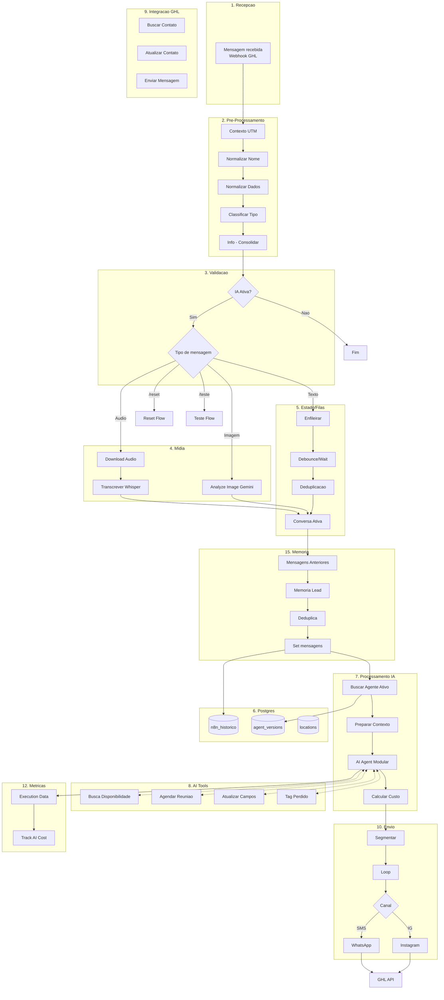

# 02 - CATEGORIZACAO FUNCIONAL

**Workflow:** GHL - Mottivme - EUA Versionado
**ID:** R2fVs2qpct1Qr2Y1
**Data da Analise:** 2025-12-31
**Agente Responsavel:** Agente 2 - Especialista em Categorizacao Funcional

---

## 1. TAXONOMIA FUNCIONAL

### CATEGORIA 1: Recepcao de Mensagens

| ID | Nome do No | Tipo |
|----|-----------|------|
| bbb23c98-0b8c-4a77-a38d-8e8bcd3dc0f4 | Mensagem recebida | n8n-nodes-base.webhook |

**Proposito da Categoria:**
Ponto de entrada do fluxo. Recebe webhooks do GoHighLevel contendo mensagens de leads via WhatsApp, Instagram ou SMS.

**Fluxo Interno:**
1. Webhook recebe payload do GHL
2. Dados brutos sao encaminhados para processamento inicial

---

### CATEGORIA 2: Pre-Processamento e Normalizacao de Dados

| ID | Nome do No | Tipo |
|----|-----------|------|
| 8ec83b65-d1ee-44ed-9c6c-518767efaa96 | Contexto UTM | n8n-nodes-base.code |
| 2613bf85-8e78-4ce2-8a5b-4824bd8f62a9 | Normalizar Nome1 | n8n-nodes-base.code |
| 13417ca6-d87d-4026-bc68-428b9d441a65 | Normalizar Dados1 | n8n-nodes-base.code |
| 8e3e4049-8662-4f80-b877-3682c8ed9a9e | Execution Data5 | n8n-nodes-base.executionData |
| f94f1796-7e0e-41a6-b5b9-dc9bdb08be95 | Code1 | n8n-nodes-base.code |
| 9c3a06ca-329b-4b18-b4f8-01b69685e9fe | Classificar Tipo Mensagem | n8n-nodes-base.code |
| f1d208a5-f05b-45bb-ae27-8ceb310344a1 | Info | n8n-nodes-base.set |

**Proposito da Categoria:**
Normalizar e enriquecer dados recebidos do webhook antes do processamento principal.

**Fluxo Interno:**
1. **Contexto UTM**: Extrai contexto inicial baseado em parametros UTM (CARREIRA, CONSULTORIA, INVESTIMENTO)
2. **Normalizar Nome1**: Limpa e formata nomes (remove numeros, capitaliza, separa primeiro/ultimo nome)
3. **Normalizar Dados1**: Define objetivo_do_lead, agente_ia e ativar_ia baseado em tags e UTM
4. **Execution Data5**: Salva metadados da execucao (contact_id, location_name, agente_ia)
5. **Code1**: Adiciona timestamps (starttimeISO, starttimeMs, endtimeISO, endtimeMs)
6. **Classificar Tipo Mensagem**: Identifica tipo (texto, audio, imagem, pdf, planilha)
7. **Info**: Consolida todos os campos em estrutura padronizada (60+ campos mapeados)

**Inputs:** Webhook payload bruto do GHL
**Outputs:** Objeto estruturado com todos os dados do lead e mensagem normalizados

---

### CATEGORIA 3: Validacoes e Regras de Negocio

| ID | Nome do No | Tipo |
|----|-----------|------|
| 843943ea-7ec3-4b47-a662-6046beea4ae5 | IA Ativa? | n8n-nodes-base.if |
| 6737ad10-a146-4dde-99a4-39d256540f69 | Tipo de mensagem | n8n-nodes-base.switch |
| 97745add-33ee-493b-a963-79c78463b1ee | 4. Switch Objetivo | n8n-nodes-base.switch |
| 270c1971-763e-4900-8226-0a233e93f18e | Canal2 | n8n-nodes-base.switch |
| 0749b87a-d884-43e1-96c7-327f007635bb | Canal4 | n8n-nodes-base.switch |
| 5884abc6-c8a1-48ea-a37a-33dc99087a3a | Tudo certo?4 | n8n-nodes-base.if |
| ... | Varios nos If/Switch | n8n-nodes-base.if/switch |

**Proposito da Categoria:**
Aplicar regras de negocio e direcionar fluxo baseado em condicoes.

**Regras Principais:**
- **IA Ativa?**: Verifica se ativar_ia="sim" OU etiquetas contem "assistente-admin"
- **Tipo de mensagem**: Roteia para /reset, /teste, Texto, Imagem, Audio, ou mensagem vazia
- **Switch Objetivo**: Direciona para Carreira, Consultoria ou Indefinido
- **Canal**: Diferencia WhatsApp/SMS de Instagram para envio correto

---

### CATEGORIA 4: Processamento de Midia (Audio e Imagem)

| ID | Nome do No | Tipo |
|----|-----------|------|
| - | Download audio | n8n-nodes-base.httpRequest |
| - | Extract from File | n8n-nodes-base.extractFromFile |
| d63d037f-80f8-439a-8e55-598ae916cb78 | Extrair a extensao | n8n-nodes-base.code |
| - | Convert to File | n8n-nodes-base.convertToFile |
| - | Transcrever audio | n8n-nodes-base.openAi (Whisper) |
| - | Analyze image | n8n-nodes-base.googleGemini |
| - | Imagem ou audio | n8n-nodes-base.merge |

**Proposito da Categoria:**
Processar midias recebidas (audio e imagens) para texto utilizavel pela IA.

**Fluxo Interno Audio:**
1. Download do arquivo de audio (URL do GHL)
2. Extracao e conversao para formato compativel
3. Identificacao de extensao (.ogg, .mp3, .opus, .mp4)
4. Conversao para arquivo binario
5. Transcricao via OpenAI Whisper

**Fluxo Interno Imagem:**
1. Analise da imagem via Google Gemini
2. Extracao de descricao textual do conteudo

---

### CATEGORIA 5: Gerenciamento de Estado e Filas

| ID | Nome do No | Tipo |
|----|-----------|------|
| - | Enfileirar mensagem. | n8n-nodes-base.postgres |
| - | Esperar | n8n-nodes-base.wait |
| - | Buscar mensagens | n8n-nodes-base.postgres |
| - | Form Mensagem | n8n-nodes-base.code |
| - | Mensagem encavalada? | n8n-nodes-base.code |
| - | Limpar fila de mensagens | n8n-nodes-base.postgres |
| 1c54ac44-9d95-498a-85e2-21cbda7da64d | Limpar fila de mensagens1 | n8n-nodes-base.postgres |
| - | Conversa Ativa | n8n-nodes-base.postgres |
| - | Acao Planejada | n8n-nodes-base.switch |
| - | Wait | n8n-nodes-base.wait |
| - | Salvar Espera | n8n-nodes-base.postgres |
| - | Permitido AI? | n8n-nodes-base.if |
| 65ce5db2-a81b-4276-ac28-9b42c268e2fd | Resetar status atendimento | n8n-nodes-base.postgres |

**Proposito da Categoria:**
Gerenciar estado das conversas, evitar processamento duplicado e controlar filas de mensagens.

**Estrategias:**
- **Enfileiramento**: Mensagens sao enfileiradas antes do processamento
- **Debounce**: Aguarda 3-5 segundos para agrupar mensagens consecutivas
- **Deduplicacao**: Verifica mensagens encavaladas antes de processar
- **Conversa Ativa**: Consulta status atual da conversa no Postgres
- **Controle de espera**: Salva e restaura estados de aguardo

**Tabela Principal:** `n8n_historico_mensagens`

---

### CATEGORIA 6: Persistencia de Dados (Postgres)

| ID | Nome do No | Tipo | Operacao |
|----|-----------|------|----------|
| 03958c2b-30d7-414d-80b3-a4c8285000f4 | Limpar memoria | n8n-nodes-base.postgres | DELETE |
| 1c54ac44-9d95-498a-85e2-21cbda7da64d | Limpar fila de mensagens1 | n8n-nodes-base.postgres | DELETE |
| 65ce5db2-a81b-4276-ac28-9b42c268e2fd | Resetar status atendimento | n8n-nodes-base.postgres | UPSERT |
| - | Enfileirar mensagem. | n8n-nodes-base.postgres | INSERT |
| - | Conversa Ativa | n8n-nodes-base.postgres | SELECT |
| - | Salvar Espera | n8n-nodes-base.postgres | INSERT |
| - | Memoria IA | n8n-nodes-base.postgres | INSERT |
| - | Memoria Lead | n8n-nodes-base.postgres | SELECT |
| - | historico_mensagens_leads | n8n-nodes-base.postgres | INSERT |
| f2684337-4b8a-4954-a53d-ffed5ca68eae | Buscar Agente Ativo | n8n-nodes-base.postgres | SELECT |
| - | Postgres | n8n-nodes-base.postgres | INSERT |
| - | Salvar registro de Atividade - alan | n8n-nodes-base.postgres | INSERT |
| - | Salvar registro de Atividade - marcos | n8n-nodes-base.postgres | INSERT |
| - | Salvar Inicio IA | n8n-nodes-base.postgres | INSERT |

**Proposito da Categoria:**
Persistir dados de conversas, historico, metricas e estado.

**Tabelas Utilizadas:**
- `n8n_historico_mensagens` - Historico de mensagens por sessao
- `agent_versions` - Versoes de agentes ativos
- `locations` - Configuracoes por location (API keys)
- Tabelas de atividades e metricas

**Credencial:** "Postgres Marcos Daniels." (id: w2mBaRwhZ3tM4FUw)

---

### CATEGORIA 7: Processamento de IA (LLM)

| ID | Nome do No | Tipo |
|----|-----------|------|
| 0366bcbe-bd9c-4cc1-b70f-32e78cd12ab7 | AI Agent - Modular | @n8n/n8n-nodes-langchain.agent |
| - | Gemini2 | @n8n/n8n-nodes-langchain.lmChatGoogleGemini |
| - | Google Gemini Chat Model2 | @n8n/n8n-nodes-langchain.lmChatGoogleGemini |
| - | Parser Chain | @n8n/n8n-nodes-langchain.chainLlm |
| - | Structured Output Parser | @n8n/n8n-nodes-langchain.outputParserStructured |
| a8c6ff15-2dbf-44d3-b217-ea8b38592efa | Preparar Execucao + Identificar Contexto | n8n-nodes-base.code |
| 984d5b6e-e8f2-48ab-b0c6-c1143f678507 | Calcular Custo LLM | n8n-nodes-base.code |
| 652cfa81-36ca-4a54-9752-b2a51205df53 | Code in JavaScript2 | n8n-nodes-base.code |

**Proposito da Categoria:**
Processar mensagens com IA generativa para gerar respostas contextualizadas.

**Modelo Principal:** Gemini 2.5 Pro
**Modelo Secundario:** Gemini 2.5 Flash (para chat tools)

**System Prompt Inclui:**
- Contexto temporal (data/hora)
- Dados do lead (nome, telefone, email, objetivo)
- Hiperpersonalizacao (DDD, setor, porte, cargo)
- Historico de conversas
- Ferramentas disponiveis
- Regras de compliance

**Custos Estimados:**
- Gemini 2.5 Pro: $1.25/1M tokens input, $5.00/1M tokens output
- Gemini 2.5 Flash: $0.15/1M tokens input, $0.60/1M tokens output

---

### CATEGORIA 8: Tools do AI Agent

| ID | Nome do No | Tipo |
|----|-----------|------|
| - | Adicionar_tag_perdido | @n8n/n8n-nodes-langchain.toolWorkflow |
| - | Think1 | @n8n/n8n-nodes-langchain.toolThink |
| - | Busca_disponibilidade | @n8n/n8n-nodes-langchain.toolWorkflow |
| - | Agendar_reuniao | @n8n/n8n-nodes-langchain.toolWorkflow |
| - | Atualizar Work Permit | @n8n/n8n-nodes-langchain.toolWorkflow |
| - | Atualizar Profissao | @n8n/n8n-nodes-langchain.toolWorkflow |
| - | Atualizar Estado | @n8n/n8n-nodes-langchain.toolWorkflow |
| - | Busca historias | @n8n/n8n-nodes-langchain.toolWorkflow |

**Proposito da Categoria:**
Fornecer capacidades de acao ao AI Agent.

**Tools Disponiveis:**
1. **Busca_disponibilidade**: Consulta slots disponiveis no calendario GHL
2. **Agendar_reuniao**: Cria agendamento no calendario (requer nome, tel, email, eventId, data, hora)
3. **Adicionar_tag_perdido**: Desqualifica lead adicionando tag
4. **Atualizar Work Permit**: Atualiza campo customizado work_permit
5. **Atualizar Profissao**: Atualiza campo profissao do contato
6. **Atualizar Estado**: Atualiza estado/localizacao do contato
7. **Busca historias**: Busca historias/contexto do agente
8. **Think1**: Ferramenta de raciocinio (chain of thought)

---

### CATEGORIA 9: Integracoes GoHighLevel

| ID | Nome do No | Tipo | Endpoint/Operacao |
|----|-----------|------|-------------------|
| 6d921c02-f8f3-45fa-83dc-018c8cad1fba | 1. Buscar Conversa do Contato | n8n-nodes-base.httpRequest | GET /conversations/search |
| e1f52353-ebd5-4ba8-8b91-9db2bbd32b14 | 1. Listar campos customizados | n8n-nodes-base.httpRequest | GET /locations/{id}/customFields |
| 909e65a3-4dbe-440a-976c-c983a17ad755 | ativar_ia2 | n8n-nodes-base.httpRequest | PUT /contacts/{id} |
| 9d7bc33a-d829-4a61-bb48-73a74c8feedc | 5. Atualizar -> Carreira | n8n-nodes-base.httpRequest | PUT /contacts/{id} |
| 30fa385d-0d5e-4cbb-80cf-5eba3cd244e4 | 5. Atualizar -> Consultoria | n8n-nodes-base.httpRequest | PUT /contacts/{id} |
| cc88b517-55a9-4445-8f03-4d894e55c35c | Update Contact (Outbound) | n8n-nodes-base.httpRequest | PUT /contacts/{id} |
| 9650f9b9-a652-4b3e-b4c7-55ee0efe9981 | Update Contact (Outbound)2 | n8n-nodes-base.httpRequest | PUT /contacts/{id} |
| d00a6a26-7103-4ad3-a829-7a80ef73c910 | Whatsapp2 | n8n-nodes-base.httpRequest | POST /conversations/messages |
| 7f184ebf-86ae-4cc2-a23b-7162cec06661 | Instagram2 | n8n-nodes-base.httpRequest | POST /conversations/messages |
| - | Whatsapp | n8n-nodes-base.httpRequest | POST /conversations/messages |
| - | Instagram | n8n-nodes-base.httpRequest | POST /conversations/messages |
| 75cf217d-647f-4c11-886f-05b0ff3c4209 | 5. Perguntar Objetivo (SMS) | n8n-nodes-base.httpRequest | POST /conversations/messages |
| 0d5d114d-5cd6-4881-ac4c-183ea94a17a5 | Instagram4 | n8n-nodes-base.httpRequest | POST /conversations/messages |
| - | Search Contact | n8n-nodes-base.httpRequest | GET /contacts/search |
| - | GetInfo | n8n-nodes-base.code | Processa dados do contato |
| - | Atualizar resposta IA | n8n-nodes-base.httpRequest | PUT /contacts/{id} |

**Proposito da Categoria:**
Integrar com a API do GoHighLevel para operacoes CRUD.

**Base URL:** `https://services.leadconnectorhq.com`
**Versao API:** 2021-07-28
**Autenticacao:** Bearer token via customData.ghl_api_key

**Operacoes:**
- **Contatos**: Buscar, atualizar campos customizados
- **Conversas**: Buscar, enviar mensagens
- **Custom Fields**: Listar campos da location
- **Mensagens**: Enviar via WhatsApp (SMS type), Instagram (IG type)

---

### CATEGORIA 10: Comunicacao e Envio de Mensagens

| ID | Nome do No | Tipo | Canal |
|----|-----------|------|-------|
| - | Whatsapp | n8n-nodes-base.httpRequest | SMS |
| - | Instagram | n8n-nodes-base.httpRequest | IG |
| d00a6a26-7103-4ad3-a829-7a80ef73c910 | Whatsapp2 | n8n-nodes-base.httpRequest | SMS |
| 7f184ebf-86ae-4cc2-a23b-7162cec06661 | Instagram2 | n8n-nodes-base.httpRequest | IG |
| 75cf217d-647f-4c11-886f-05b0ff3c4209 | 5. Perguntar Objetivo (SMS) | n8n-nodes-base.httpRequest | SMS |
| 0d5d114d-5cd6-4881-ac4c-183ea94a17a5 | Instagram4 | n8n-nodes-base.httpRequest | IG |
| - | Loop Over Items3 | n8n-nodes-base.splitInBatches | Segmentacao |
| - | Canal | n8n-nodes-base.switch | Roteamento |
| - | 1.5s | n8n-nodes-base.wait | Rate limiting |

**Proposito da Categoria:**
Enviar mensagens de resposta para os leads via canais apropriados.

**Fluxo de Envio:**
1. Segmentacao de mensagens longas (Segmentos1)
2. Loop para envio sequencial (Loop Over Items3)
3. Memoria IA - salva resposta
4. Roteamento por canal (Canal switch)
5. Envio via API GHL (Whatsapp ou Instagram)
6. Rate limiting 1.5s entre mensagens

---

### CATEGORIA 11: Controle de Fluxo e Classificacao de Objetivo

| ID | Nome do No | Tipo |
|----|-----------|------|
| e3cf8233-fe3a-4edc-930a-874c2e44b4da | 2. Extrair IDs dos campos | n8n-nodes-base.code |
| eefbeadb-4058-4ffc-899b-ded0d5c7fabb | 3. Detectar Objetivo | n8n-nodes-base.code |
| 97745add-33ee-493b-a963-79c78463b1ee | 4. Switch Objetivo | n8n-nodes-base.switch |
| 995b1e60-b25c-41fb-8d63-bcf7aab0ddc2 | Code in JavaScript | n8n-nodes-base.code |
| 4e81f664-f606-4f1d-b5d2-19af31a16690 | Edit Fields | n8n-nodes-base.set |

**Proposito da Categoria:**
Classificar leads por objetivo e direcionar para fluxo adequado.

**Logica de Deteccao:**
1. Comando /teste na mensagem
2. Campo objetivo_do_lead ja preenchido
3. Campo especialista_motive definido
4. Analise de keywords no texto

**Keywords Carreira:** carreira, recrutamento, recrutar, vaga, emprego, trabalho
**Keywords Consultoria:** consultoria, consultor, mentor, mentoria

**Especialistas Mapeados:**
- `sdrcarreira` -> Objetivo: carreira
- `sdrconsultoria` -> Objetivo: consultoria

---

### CATEGORIA 12: Metricas e Observabilidade

| ID | Nome do No | Tipo |
|----|-----------|------|
| 8e3e4049-8662-4f80-b877-3682c8ed9a9e | Execution Data5 | n8n-nodes-base.executionData |
| - | Execution Data | n8n-nodes-base.executionData |
| - | Execution Data1 | n8n-nodes-base.executionData |
| - | Execution Data2 | n8n-nodes-base.executionData |
| 3124778a-2ba5-4aaf-a038-c8da82371a9d | Call Track AI Cost | n8n-nodes-base.executeWorkflow |
| 984d5b6e-e8f2-48ab-b0c6-c1143f678507 | Calcular Custo LLM | n8n-nodes-base.code |
| 652cfa81-36ca-4a54-9752-b2a51205df53 | Code in JavaScript2 | n8n-nodes-base.code |
| - | Salvar registro de Atividade - alan | n8n-nodes-base.postgres |
| - | Salvar registro de Atividade - marcos | n8n-nodes-base.postgres |

**Proposito da Categoria:**
Rastrear custos, metricas de uso e registrar atividades.

**Metricas Coletadas:**
- Tokens de input/output (estimado)
- Custo em USD e BRL
- Execution ID e Workflow ID
- Contact ID e Location ID
- Tipo de acao e canal

**Subworkflow:** Call Track AI Cost - registra custos em tabela dedicada

---

### CATEGORIA 13: Transformacoes de Dados

| ID | Nome do No | Tipo |
|----|-----------|------|
| f1d208a5-f05b-45bb-ae27-8ceb310344a1 | Info | n8n-nodes-base.set |
| 4e81f664-f606-4f1d-b5d2-19af31a16690 | Edit Fields | n8n-nodes-base.set |
| a53eef4d-8a90-4ff4-9be3-107e122fd71c | Edit Fields2 | n8n-nodes-base.set |
| - | Edit Fields1 | n8n-nodes-base.set |
| - | Set mensagens | n8n-nodes-base.set |
| - | Deduplica Mensagens | n8n-nodes-base.code |
| - | Preparar Mensagem | n8n-nodes-base.code |
| - | Segmentos1 | n8n-nodes-base.code |
| - | Form Mensagem | n8n-nodes-base.code |
| - | no.op | n8n-nodes-base.noOp |

**Proposito da Categoria:**
Transformar e formatar dados entre etapas do fluxo.

**Transformacoes Principais:**
- Mapeamento de 60+ campos do webhook para estrutura padrao (Info)
- Deduplicacao de mensagens por hash
- Segmentacao de respostas longas
- Formatacao de historico para contexto da IA

---

### CATEGORIA 14: Comandos Especiais (/reset, /teste)

| ID | Nome do No | Tipo |
|----|-----------|------|
| 6d921c02-f8f3-45fa-83dc-018c8cad1fba | 1. Buscar Conversa do Contato | n8n-nodes-base.httpRequest |
| 995b1e60-b25c-41fb-8d63-bcf7aab0ddc2 | Code in JavaScript | n8n-nodes-base.code |
| 4e81f664-f606-4f1d-b5d2-19af31a16690 | Edit Fields | n8n-nodes-base.set |
| 03958c2b-30d7-414d-80b3-a4c8285000f4 | Limpar memoria | n8n-nodes-base.postgres |
| 909e65a3-4dbe-440a-976c-c983a17ad755 | ativar_ia2 | n8n-nodes-base.httpRequest |
| cc88b517-55a9-4445-8f03-4d894e55c35c | Update Contact (Outbound) | n8n-nodes-base.httpRequest |
| 65ce5db2-a81b-4276-ac28-9b42c268e2fd | Resetar status atendimento | n8n-nodes-base.postgres |
| e1f52353-ebd5-4ba8-8b91-9db2bbd32b14 | 1. Listar campos customizados | n8n-nodes-base.httpRequest |
| e3cf8233-fe3a-4edc-930a-874c2e44b4da | 2. Extrair IDs dos campos | n8n-nodes-base.code |
| eefbeadb-4058-4ffc-899b-ded0d5c7fabb | 3. Detectar Objetivo | n8n-nodes-base.code |

**Proposito da Categoria:**
Processar comandos especiais do usuario.

**Comando /reset:**
1. Busca conversa do contato
2. Limpa historico de mensagens (DELETE n8n_historico_mensagens)
3. Ativa IA novamente
4. Reseta status de atendimento
5. Envia confirmacao "Memoria resetada"

**Comando /teste:**
1. Lista campos customizados da location
2. Extrai IDs dos campos (ativar_ia, especialista_motive, objetivo_lead)
3. Detecta objetivo do teste (carreira/consultoria)
4. Atualiza campos no contato
5. Ativa o agente correspondente

---

### CATEGORIA 15: Memoria e Historico de Conversas

| ID | Nome do No | Tipo |
|----|-----------|------|
| - | Mensagem anteriores | n8n-nodes-base.postgres |
| - | Preparar Mensagem | n8n-nodes-base.code |
| - | Memoria Lead | n8n-nodes-base.postgres |
| - | Deduplica Mensagens | n8n-nodes-base.code |
| - | Set mensagens | n8n-nodes-base.set |
| - | Memoria IA | n8n-nodes-base.postgres |
| - | historico_mensagens_leads | n8n-nodes-base.postgres |

**Proposito da Categoria:**
Gerenciar memoria conversacional para contexto da IA.

**Fluxo:**
1. Busca mensagens anteriores do lead (Mensagem anteriores)
2. Prepara formato para IA (Preparar Mensagem)
3. Consulta memoria persistente (Memoria Lead)
4. Remove duplicatas (Deduplica Mensagens)
5. Consolida em formato final (Set mensagens)
6. Apos resposta, salva na memoria (Memoria IA)

---

### CATEGORIA 16: Notas/Documentacao (Sticky Notes)

| ID | Nome do No | Conteudo |
|----|-----------|----------|
| f089e8e5-627d-4b74-ac52-df7d9edbe802 | Sticky Note5 | "# Tratando input" |
| 98eceb9a-ff83-47eb-a284-e3276cb4085e | Sticky Note10 | "## Resetar conversa" (disabled) |
| 1cc3eeca-d2c5-438b-af52-1e9ee4af2d41 | Sticky Note21 | "## Habilitar testes" (disabled) |
| 8f1a29fa-ae14-4339-916c-e889b462df53 | Sticky Note22 | "## Enviar mensagem" |

**Proposito da Categoria:**
Documentacao visual inline para desenvolvedores.

---

## 2. MAPA DE DOMINIOS

---

## 3. MATRIZ DE CRITICIDADE

| Categoria | Nos Criticos | Impacto de Falha | Retry? | Observacoes |
|-----------|-------------|------------------|--------|-------------|
| 1. Recepcao | Mensagem recebida | ALTO - Perde mensagem | Nao | Webhook GHL |
| 2. Pre-Processamento | Info, Normalizar | MEDIO - Dados incompletos | Nao | Graceful degradation |
| 3. Validacoes | IA Ativa?, Tipo mensagem | BAIXO - Segue default | Nao | Fallback seguro |
| 4. Midia | Transcrever audio | MEDIO - Perde contexto audio | Sim | Retry automatico |
| 5. Estado/Filas | Conversa Ativa, Enfileirar | ALTO - Duplicacao/perda | Nao | Idempotencia critica |
| 6. Postgres | Todas operacoes | ALTO - Perde historico | Nao | Conexao pooling |
| 7. IA (LLM) | AI Agent Modular | ALTO - Sem resposta | Sim | Retry loop |
| 8. Tools | Agendar_reuniao | ALTO - Perde agendamento | Sim | Validacao previa |
| 9. GHL | Todas requisicoes | ALTO - Falha comunicacao | Sim | Rate limiting |
| 10. Envio | Whatsapp, Instagram | ALTO - Mensagem nao entrega | Sim | Retry ativo |
| 11. Classificacao | Detectar Objetivo | MEDIO - Objetivo errado | Nao | Default: indefinido |
| 12. Metricas | Track AI Cost | BAIXO - Perde metricas | Nao | onError: continueRegularOutput |
| 13. Transformacoes | Segmentos1 | BAIXO - Mensagem cortada | Nao | - |
| 14. Comandos | /reset, /teste | MEDIO - Comando nao executa | Nao | Feedback ao usuario |
| 15. Memoria | Memoria Lead | MEDIO - Contexto incompleto | Nao | Graceful degradation |

---

## 4. ANALISE POR CATEGORIA

### CATEGORIA 1: Recepcao de Mensagens

**Proposito:** Ponto unico de entrada para todas as mensagens do GHL
**Responsabilidade:** Receber webhooks e iniciar processamento
**Inputs:** Webhook POST do GoHighLevel
**Outputs:** Payload JSON com dados da mensagem e contato
**Dependencias:** Nenhuma (ponto de entrada)
**Criticidade:** ALTA
**Observacoes:**
- Webhook deve estar sempre ativo
- Nao ha retry nativo - mensagem perdida e irrecuperavel
- Path: /webhook/742766a1-1f96-4420-877b-ac3035ef5e3c

---

### CATEGORIA 2: Pre-Processamento e Normalizacao

**Proposito:** Preparar dados brutos para processamento consistente
**Responsabilidade:** Normalizar nomes, detectar contexto UTM, classificar tipo de mensagem
**Inputs:** Payload bruto do webhook
**Outputs:** Objeto Info com 60+ campos padronizados
**Dependencias:** Categoria 1
**Criticidade:** MEDIA
**Observacoes:**
- Campos ausentes recebem valores default
- Deteccao de tipo de mensagem por extensao de arquivo
- Suporta: texto, audio (.ogg, .mp3, .opus, .mp4), imagem (.jpg, .png, .webp), pdf, planilha

---

### CATEGORIA 3: Validacoes e Regras de Negocio

**Proposito:** Aplicar regras de negocio e direcionar fluxo
**Responsabilidade:** Verificar se IA esta ativa, rotear por tipo de mensagem e canal
**Inputs:** Objeto Info normalizado
**Outputs:** Direcionamento para branch correto
**Dependencias:** Categoria 2
**Criticidade:** BAIXA
**Observacoes:**
- IA e ativada se ativar_ia="sim" OU tag "assistente-admin"
- 6 outputs do switch Tipo de mensagem: /reset, /teste, Texto, Imagem, Audio, vazia

---

### CATEGORIA 4: Processamento de Midia

**Proposito:** Converter audio e imagens para texto
**Responsabilidade:** Transcricao de audio (Whisper), analise de imagem (Gemini)
**Inputs:** URL de arquivo de midia
**Outputs:** Texto transcrito/descricao
**Dependencias:** Categoria 3, APIs OpenAI e Google
**Criticidade:** MEDIA
**Observacoes:**
- Audio: Suporta .ogg, .mp3, .opus, .mp4, .wav, .m4a
- Imagem: Analise via Google Gemini
- Retry ativo em transcricao

---

### CATEGORIA 5: Gerenciamento de Estado

**Proposito:** Evitar processamento duplicado e controlar concorrencia
**Responsabilidade:** Enfileirar, debounce, verificar conversa ativa
**Inputs:** Mensagem a processar
**Outputs:** Mensagem consolidada ou descarte
**Dependencias:** Categoria 6 (Postgres)
**Criticidade:** ALTA
**Observacoes:**
- Debounce de 3-5 segundos agrupa mensagens consecutivas
- Verifica se ja existe conversa ativa antes de processar
- Tabela: n8n_historico_mensagens

---

### CATEGORIA 6: Persistencia de Dados

**Proposito:** Armazenar dados de forma persistente
**Responsabilidade:** CRUD em tabelas Postgres
**Inputs:** Dados a persistir
**Outputs:** Dados persistidos/recuperados
**Dependencias:** Conexao Postgres
**Criticidade:** ALTA
**Observacoes:**
- Credencial: "Postgres Marcos Daniels." (w2mBaRwhZ3tM4FUw)
- Tabelas: n8n_historico_mensagens, agent_versions, locations
- Operacoes: SELECT, INSERT, UPSERT, DELETE

---

### CATEGORIA 7: Processamento de IA

**Proposito:** Gerar respostas inteligentes contextualizadas
**Responsabilidade:** Executar AI Agent com contexto completo
**Inputs:** Mensagem + historico + contexto do lead
**Outputs:** Resposta gerada pela IA
**Dependencias:** Categoria 6 (agente ativo), Google Gemini API
**Criticidade:** ALTA
**Observacoes:**
- Modelo principal: Gemini 2.5 Pro
- System prompt inclui hiperpersonalizacao (DDD, setor, porte, cargo)
- Custos estimados: ~$0.012-0.025 por mensagem

---

### CATEGORIA 8: Tools do AI Agent

**Proposito:** Permitir acoes do agente no mundo real
**Responsabilidade:** Executar workflows externos sob demanda
**Inputs:** Parametros da tool call
**Outputs:** Resultado da acao
**Dependencias:** Subworkflows externos
**Criticidade:** ALTA (para agendamentos)
**Observacoes:**
- Busca_disponibilidade: OBRIGATORIO antes de oferecer horarios
- Agendar_reuniao: Requer nome, telefone, email, eventId, data, hora
- Formatos: Telefone +00000000000, Data MM/dd/yyyy, Hora 12h AM/PM

---

### CATEGORIA 9: Integracoes GoHighLevel

**Proposito:** Comunicar com API do GHL
**Responsabilidade:** CRUD de contatos, conversas e custom fields
**Inputs:** Dados a enviar/buscar
**Outputs:** Resposta da API GHL
**Dependencias:** API Key do GHL (customData.ghl_api_key)
**Criticidade:** ALTA
**Observacoes:**
- Base URL: https://services.leadconnectorhq.com
- Versao: 2021-07-28
- Retry ativo em requisicoes criticas

---

### CATEGORIA 10: Comunicacao e Envio

**Proposito:** Entregar respostas aos leads
**Responsabilidade:** Segmentar e enviar mensagens pelo canal correto
**Inputs:** Texto de resposta da IA
**Outputs:** Mensagem enviada via GHL
**Dependencias:** Categoria 9 (API GHL)
**Criticidade:** ALTA
**Observacoes:**
- Rate limiting: 1.5s entre mensagens
- Canais: SMS (type: "SMS"), Instagram (type: "IG")
- Loop para mensagens segmentadas

---

### CATEGORIA 11: Classificacao de Objetivo

**Proposito:** Identificar objetivo do lead automaticamente
**Responsabilidade:** Classificar em carreira, consultoria ou indefinido
**Inputs:** Mensagem, tags, UTM, campos custom
**Outputs:** objetivo_do_lead, especialista_motive
**Dependencias:** Categoria 2 (dados normalizados)
**Criticidade:** MEDIA
**Observacoes:**
- Prioridade: comando /teste > campo existente > especialista > analise texto
- Keywords detectadas automaticamente
- Se indefinido, pergunta ao usuario

---

### CATEGORIA 12: Metricas e Observabilidade

**Proposito:** Rastrear custos e uso
**Responsabilidade:** Calcular custos LLM, registrar atividades
**Inputs:** Resposta da IA, tokens estimados
**Outputs:** Metricas salvas
**Dependencias:** Subworkflow Track AI Cost
**Criticidade:** BAIXA
**Observacoes:**
- onError: continueRegularOutput (nao bloqueia fluxo)
- Calculo de custo: Gemini Pro + Flash combinados
- Conversao USD para BRL (fator 6x)

---

### CATEGORIA 13: Transformacoes de Dados

**Proposito:** Manipular e formatar dados
**Responsabilidade:** Set fields, deduplicar, segmentar
**Inputs:** Dados em formato A
**Outputs:** Dados em formato B
**Dependencias:** Varia por no
**Criticidade:** BAIXA
**Observacoes:**
- Info: Mapeamento central de 60+ campos
- Segmentos1: Divide respostas longas
- Deduplica: Remove mensagens duplicadas por hash

---

### CATEGORIA 14: Comandos Especiais

**Proposito:** Processar comandos administrativos
**Responsabilidade:** Executar /reset e /teste
**Inputs:** Mensagem com comando
**Outputs:** Acao executada + confirmacao
**Dependencias:** Categorias 6 e 9
**Criticidade:** MEDIA
**Observacoes:**
- /reset: Limpa historico, reativa IA
- /teste: Configura objetivo manualmente
- Feedback enviado ao usuario

---

### CATEGORIA 15: Memoria e Historico

**Proposito:** Manter contexto conversacional
**Responsabilidade:** Buscar e salvar historico de mensagens
**Inputs:** session_id (lead_id)
**Outputs:** Historico formatado para IA
**Dependencias:** Categoria 6 (Postgres)
**Criticidade:** MEDIA
**Observacoes:**
- Tabela: n8n_historico_mensagens
- Deduplicacao por message_hash
- Limite de mensagens para contexto

---

### CATEGORIA 16: Documentacao

**Proposito:** Documentar workflow visualmente
**Responsabilidade:** N/A (apenas visual)
**Inputs:** N/A
**Outputs:** N/A
**Dependencias:** Nenhuma
**Criticidade:** N/A
**Observacoes:**
- 4 sticky notes identificados
- Algumas desabilitadas (disabled: true)

---

## RESUMO ESTATISTICO

| Metrica | Valor |
|---------|-------|
| Total de nos | ~80 |
| Categorias funcionais | 16 |
| Nos Postgres | 14 |
| Nos HTTP Request | 15+ |
| Nos Code (JavaScript) | 12 |
| Nos Switch/If | 8 |
| Tools do AI Agent | 8 |
| Sticky Notes | 4 |

---

**Documento gerado por:** Agente 2 - Especialista em Categorizacao Funcional
**Versao:** 1.0
**Data:** 2025-12-31
