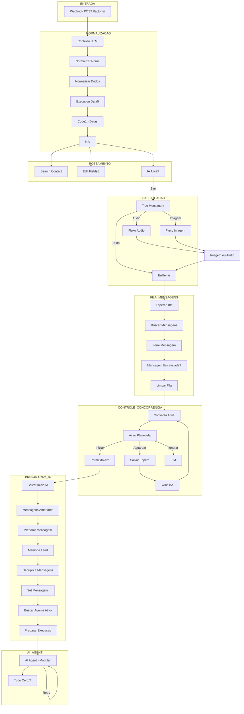
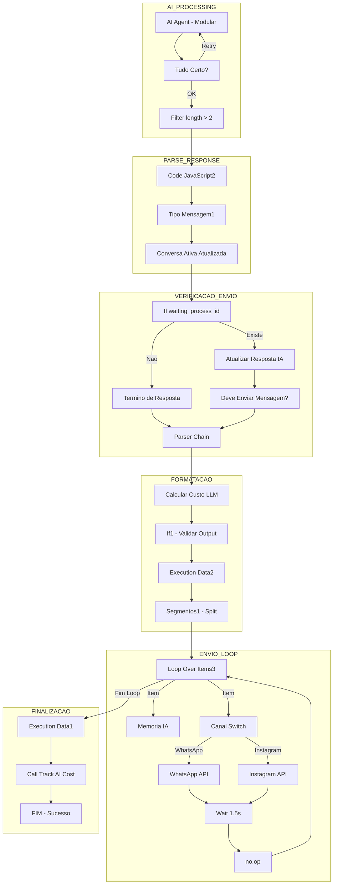

# Fluxo de Dados - GHL Mottivme EUA Versionado

**Documento:** 03_FLUXO_DE_DADOS.md
**Workflow:** GHL - Mottivme - EUA Versionado
**ID:** R2fVs2qpct1Qr2Y1
**Data:** 2025-12-31

---

## 1. DATA LINEAGE PRINCIPAL

### 1.1 Fluxo Happy Path (Caminho Normal de Mensagem)

```
ENTRADA (Webhook: POST /factor-ai)
    |
    | Dados: { body.contact_id, body.location, body.message, body.type, etc. }
    v
+-------------------------------------------+
|  No: "Mensagem recebida" (Webhook)        |
|  ID: 8b088c6c-3506-4bb1-98e1-8549cf75152a |
+-------------------------------------------+
    |
    | [Dados brutos do GHL/Lead Connector]
    v
+-------------------------------------------+
|  No: "Contexto UTM" (Code)                |
|  ID: 8ec83b65-d1ee-44ed-9c6c-518767efaa96 |
|  Transformacao: Extrai UTM parameters     |
+-------------------------------------------+
    |
    v
+-------------------------------------------+
|  No: "Normalizar Nome1" (Code)            |
|  ID: 2613bf85-8e78-4ce2-8a5b-4824bd8f62a9 |
|  Transformacao: Padroniza nomes           |
+-------------------------------------------+
    |
    v
+-------------------------------------------+
|  No: "Normalizar Dados1" (Code)           |
|  ID: 13417ca6-d87d-4026-bc68-428b9d441a65 |
|  Transformacao: Normaliza estrutura dados |
+-------------------------------------------+
    |
    v
+-------------------------------------------+
|  No: "Execution Data5"                    |
|  ID: 8e3e4049-8662-4f80-b877-3682c8ed9a9e |
|  Salva: contact_id, location_name,        |
|         agente_ia                         |
+-------------------------------------------+
    |
    v
+-------------------------------------------+
|  No: "Code1" (Code)                       |
|  ID: f94f1796-7e0e-41a6-b5b9-dc9bdb08be95 |
|  Adiciona: starttimeISO, endtimeISO       |
|           (7 dias a partir de agora)      |
+-------------------------------------------+
    |
    v
+-------------------------------------------+
|  No: "Classificar Tipo Mensagem" -> "Info"|
|  ID: [varios]                             |
|  Output principal: json com dados do lead |
+-------------------------------------------+
    |
    | [Fluxo paralelo: 3 caminhos]
    +------------------------------------+
    |                |                   |
    v                v                   v
[Search       [Edit Fields1         [IA Ativa?
Contact]      + historico]          condicional]
    |                                   |
    v                                   v
+-------------------------------------------+
|  No: "Tipo de mensagem" (Switch)          |
|  Decide: Texto simples | Audio | Imagem   |
+-------------------------------------------+
    |
    | [Se tipo = Texto simples, continua]
    v
+-------------------------------------------+
|  No: "Enfileirar mensagem." (Postgres)    |
|  Tabela: n8n_fila_mensagens               |
|  INSERT: mensagem, id_mensagem,           |
|          timestamp, lead_id               |
+-------------------------------------------+
    |
    v
+-------------------------------------------+
|  No: "Esperar" (Wait: 18s)                |
|  Proposito: Aguardar mensagens encavaladas|
+-------------------------------------------+
    |
    v
+-------------------------------------------+
|  No: "Buscar mensagens" (Postgres)        |
|  SELECT * FROM n8n_fila_mensagens         |
|  WHERE lead_id = ?                        |
|  ORDER BY timestamp                       |
+-------------------------------------------+
    |
    v
+-------------------------------------------+
|  No: "Form Mensagem" (Set)                |
|  Output: last_db_message, current_message |
+-------------------------------------------+
    |
    v
+-------------------------------------------+
|  No: "Mensagem encavalada?" (Code)        |
|  Logica: Verifica se ultima mensagem      |
|  do DB == mensagem do workflow atual      |
+-------------------------------------------+
    |
    v
+-------------------------------------------+
|  No: "Limpar fila de mensagens" (Postgres)|
|  DELETE FROM n8n_fila_mensagens           |
|  WHERE lead_id = ?                        |
+-------------------------------------------+
    |
    v
+-------------------------------------------+
|  No: "Conversa Ativa" (Postgres)          |
|  Tabela: n8n_active_conversation          |
|  SELECT onde: lead_id, workflow_id        |
+-------------------------------------------+
    |
    v
+-------------------------------------------+
|  No: "Acao Planejada" (Switch)            |
|  Rotas:                                   |
|  1. Iniciar Conversa (vazio/inativo)      |
|  2. Ignorar (retries > 10)                |
|  3. Aguardar (active)                     |
+-------------------------------------------+
    |
    | [Se Iniciar Conversa]
    v
+-------------------------------------------+
|  No: "Permitido AI?" (Filter)             |
|  Condicoes: n8n_ativo = true              |
|            mensagem != "okkk"             |
+-------------------------------------------+
    |
    v
+-------------------------------------------+
|  No: "Salvar Inicio IA" (Postgres)        |
|  UPSERT n8n_active_conversation           |
|  status = 'active'                        |
+-------------------------------------------+
    |
    v
+-------------------------------------------+
|  No: "Mensagem anteriores" (Postgres)     |
|  SELECT FROM n8n_historico_mensagens      |
|  WHERE session_id = lead_id               |
|  ORDER BY created_at                      |
+-------------------------------------------+
    |
    v
+-------------------------------------------+
|  No: "Preparar Mensagem" (Code)           |
|  Sanitiza mensagem, prepara objeto JSON   |
|  Output: {lead_id, session_id, message}   |
+-------------------------------------------+
    |
    v
+-------------------------------------------+
|  No: "Memoria Lead" (Postgres)            |
|  INSERT n8n_historico_mensagens           |
|  (message, session_id)                    |
+-------------------------------------------+
    |
    v
+-------------------------------------------+
|  No: "Deduplica Mensagens" (Code)         |
|  Remove mensagens duplicadas              |
|  Formata historico cronologicamente       |
+-------------------------------------------+
    |
    v
+-------------------------------------------+
|  No: "Set mensagens" (Set)                |
|  Monta contexto para IA:                  |
|  - mensagem (texto/audio/imagem)          |
|  - output_preview                         |
|  - mensagens_antigas (historico)          |
|  - location_id                            |
+-------------------------------------------+
    |
    v
+-------------------------------------------+
|  No: "Buscar Agente Ativo" (Postgres)     |
|  SELECT agent_versions + locations        |
|  WHERE is_active = true                   |
+-------------------------------------------+
    |
    v
+-------------------------------------------+
|  No: "Preparar Execucao + Identificar     |
|       Contexto" (Code)                    |
|  Monta prompt completo para agente IA     |
+-------------------------------------------+
    |
    v
+-------------------------------------------+
|  No: "AI Agent - Modular" (LangChain)     |
|  LLM: Gemini 2.5 Pro                      |
|  Tools: 8 ferramentas conectadas          |
|  Input: mensagem do lead + contexto       |
|  Output: { output: "resposta" }           |
+-------------------------------------------+
    |
    v
+-------------------------------------------+
|  No: "Tudo certo?4" (If)                  |
|  Valida: output nao contem <ctrl          |
|          output nao esta vazio            |
+-------------------------------------------+
    |
    | [Se OK]
    v
+-------------------------------------------+
|  No: "Filter"                             |
|  Condicao: output.length > 2              |
+-------------------------------------------+
    |
    v
+-------------------------------------------+
|  No: "Code in JavaScript2" (Code)         |
|  Processa output do AI Agent              |
+-------------------------------------------+
    |
    v
+-------------------------------------------+
|  No: "Tipo de mensagem1" (Switch)         |
|  Rota baseada em Set mensagens.mensagem   |
+-------------------------------------------+
    |
    v
+-------------------------------------------+
|  No: "Conversa ativa atualizada"(Postgres)|
|  SELECT n8n_active_conversation           |
|  Verifica estado atual                    |
+-------------------------------------------+
    |
    v
+-------------------------------------------+
|  No: "If" (Condicional)                   |
|  Se waiting_process_id existe:            |
|    -> Atualizar resposta IA               |
|  Senao:                                   |
|    -> Termino de resposta                 |
+-------------------------------------------+
    |
    v
+-------------------------------------------+
|  No: "Parser Chain" (LangChain LLM)       |
|  LLM: Google Gemini Flash                 |
|  Formata mensagem para WhatsApp/Instagram |
|  Output: { messages: ["msg1", "msg2"] }   |
+-------------------------------------------+
    |
    v
+-------------------------------------------+
|  No: "Calcular Custo LLM" (workflow)      |
|  Calcula tokens e custos                  |
+-------------------------------------------+
    |
    v
+-------------------------------------------+
|  No: "If1" (Condicional)                  |
|  Verifica se output nao contem JSON       |
|  malformado/variaveis expostas            |
+-------------------------------------------+
    |
    v
+-------------------------------------------+
|  No: "Execution Data2"                    |
|  Salva: agente_ia                         |
+-------------------------------------------+
    |
    v
+-------------------------------------------+
|  No: "Segmentos1" (SplitOut)              |
|  Divide output.messages em items          |
|  separados para envio sequencial          |
+-------------------------------------------+
    |
    v
+-------------------------------------------+
|  No: "Loop Over Items3" (SplitInBatches)  |
|  Processa cada mensagem individualmente   |
+-------------------------------------------+
    |
    | [Loop: Para cada mensagem]
    +---> [Memoria IA] + [Canal]
    |
    v
+-------------------------------------------+
|  No: "Memoria IA" (Postgres)              |
|  INSERT n8n_historico_mensagens           |
|  type: "ai", content: resposta            |
+-------------------------------------------+
    |
    v
+-------------------------------------------+
|  No: "Canal" (Switch)                     |
|  Roteamento por source:                   |
|  - whatsapp -> No "Whatsapp"              |
|  - instagram -> No "Instagram"            |
+-------------------------------------------+
    |
    v
+-------------------------------------------+
|  No: "Whatsapp" / "Instagram" (HTTP)      |
|  POST /conversations/messages             |
|  API: services.leadconnectorhq.com        |
|  Body: {type, contactId, message}         |
+-------------------------------------------+
    |
    v
+-------------------------------------------+
|  No: "1.5s" (Wait)                        |
|  Delay entre mensagens                    |
+-------------------------------------------+
    |
    v
+-------------------------------------------+
|  No: "no.op" (NoOp)                       |
|  Volta para Loop Over Items3              |
+-------------------------------------------+
    |
    | [Apos loop completo]
    v
+-------------------------------------------+
|  No: "Execution Data1"                    |
|  Salva: a_lead_response (resposta final)  |
+-------------------------------------------+
    |
    v
+-------------------------------------------+
|  No: "Call Track AI Cost" (workflow)      |
|  Registra custos de IA                    |
+-------------------------------------------+
    |
    v
SAIDA (Resposta enviada ao lead via GHL API)
```

### 1.2 Fluxos Alternativos

#### 1.2.1 Fluxo de Audio (Transcricao)

```
[Tipo de mensagem = Audio]
    |
    v
+-------------------------------------------+
|  No: "Edit Fields2" (Set)                 |
|  Prepara: mensagem, api_key, location_id, |
|           lead_id, photo_audio            |
+-------------------------------------------+
    |
    v
+-------------------------------------------+
|  No: "Download audio" (HTTP Request)      |
|  GET photo_audio URL                      |
|  Credencial: ChatWoot API                 |
+-------------------------------------------+
    |
    v
+-------------------------------------------+
|  No: "Extract from File"                  |
|  Converte binary -> property              |
+-------------------------------------------+
    |
    v
+-------------------------------------------+
|  No: "Extrair a extensao" (Code)          |
|  Identifica formato do arquivo            |
+-------------------------------------------+
    |
    v
+-------------------------------------------+
|  No: "Convert to File"                    |
|  Prepara arquivo com fileName e mimeType  |
+-------------------------------------------+
    |
    v
+-------------------------------------------+
|  No: "Transcrever audio" (OpenAI)         |
|  API: Whisper                             |
|  Language: pt                             |
|  Output: { text: "transcricao" }          |
+-------------------------------------------+
    |
    v
+-------------------------------------------+
|  No: "Imagem ou audio" (Set)              |
|  Output: { "audio:": "[Audio]: texto" }   |
+-------------------------------------------+
    |
    +---> [Continua fluxo principal]
```

#### 1.2.2 Fluxo de Imagem (Analise)

```
[Tipo de mensagem = Imagem]
    |
    v
+-------------------------------------------+
|  No: "Analyze image" (Anthropic Claude)   |
|  Model: claude-sonnet-4-5-20250929        |
|  Prompt: "O que ha nessa imagem?"         |
|  Input: imageUrls (photo_audio)           |
+-------------------------------------------+
    |
    v
+-------------------------------------------+
|  No: "Imagem ou audio" (Set)              |
|  Output: { imagem: "[Imagem]: descricao" }|
+-------------------------------------------+
    |
    +---> [Continua fluxo principal]
```

#### 1.2.3 Fluxo de Espera (Conversa Ativa)

```
[Acao Planejada = Aguardar]
    |
    v
+-------------------------------------------+
|  No: "Salvar Espera" (Postgres)           |
|  UPSERT n8n_active_conversation           |
|  waiting_process_id = process_id atual    |
|  retries = retries + 1                    |
+-------------------------------------------+
    |
    v
+-------------------------------------------+
|  No: "Wait" (Wait: 15s)                   |
|  Aguarda processo anterior terminar       |
+-------------------------------------------+
    |
    +---> [Volta para Conversa Ativa]
```

#### 1.2.4 Fluxo de Reset (Comando especial)

```
[Trigger: Tag ou comando de reset]
    |
    v
+-------------------------------------------+
|  No: "1. Buscar Conversa do Contato"(HTTP)|
|  GET /conversations/search?contactId=X   |
+-------------------------------------------+
    |
    v
+-------------------------------------------+
|  No: "Code in JavaScript" (Code)          |
|  Processa dados da conversa               |
+-------------------------------------------+
    |
    v
+-------------------------------------------+
|  No: "Edit Fields" (Set)                  |
|  Prepara dados para limpeza               |
+-------------------------------------------+
    |
    v
+-------------------------------------------+
|  No: "Limpar memoria" (Postgres)          |
|  DELETE FROM n8n_historico_mensagens      |
+-------------------------------------------+
    |
    v
+-------------------------------------------+
|  No: "ativar_ia2" (HTTP)                  |
|  Atualiza status do contato               |
+-------------------------------------------+
    |
    v
+-------------------------------------------+
|  No: "Limpar fila de mensagens1"(Postgres)|
|  DELETE FROM n8n_fila_mensagens           |
+-------------------------------------------+
    |
    v
+-------------------------------------------+
|  No: "Canal2" (Switch)                    |
|  Envia mensagem de reset ao usuario       |
+-------------------------------------------+
```

---

## 2. TRANSFORMACOES DE DADOS

### Transformacao 1: Contexto UTM

**No:** Contexto UTM (ID: 8ec83b65-d1ee-44ed-9c6c-518767efaa96)

**Input Schema:**
```json
{
  "body": {
    "contact_id": "string",
    "location": { "id": "string", "name": "string" },
    "message": "string",
    "type": "string (whatsapp|instagram)",
    "utm_source": "string?",
    "utm_medium": "string?",
    "utm_campaign": "string?"
  }
}
```

**Transformacao Aplicada:**
- Extrai parametros UTM da mensagem/URL
- Adiciona campos de rastreamento
- Preserva dados originais

**Output Schema:**
```json
{
  "body": { "...original" },
  "utm": {
    "source": "string",
    "medium": "string",
    "campaign": "string"
  }
}
```

### Transformacao 2: Normalizar Nome

**No:** Normalizar Nome1 (ID: 2613bf85-8e78-4ce2-8a5b-4824bd8f62a9)

**Input Schema:**
```json
{
  "body": {
    "contact": {
      "firstName": "string",
      "lastName": "string",
      "fullName": "string"
    }
  }
}
```

**Transformacao Aplicada:**
- Capitaliza primeira letra de cada palavra
- Remove caracteres especiais
- Trata nomes vazios/null

**Output Schema:**
```json
{
  "first_name": "string (capitalizado)",
  "last_name": "string (capitalizado)",
  "full_name": "string (capitalizado)"
}
```

### Transformacao 3: Info (Normalizacao Principal)

**No:** Info (compilacao de varios nos Code)

**Input Schema:**
```json
{
  "body": {
    "contact_id": "string",
    "contact": {
      "firstName": "string",
      "lastName": "string",
      "phone": "string",
      "email": "string"
    },
    "location": {
      "id": "string",
      "name": "string"
    },
    "message": { "body": "string", "messageId": "string" },
    "type": "string",
    "timestamp": "string"
  }
}
```

**Transformacao Aplicada:**
- Extrai e mapeia campos essenciais
- Gera process_id unico (UUID)
- Define workflow_id
- Converte tipo de mensagem para source
- Extrai api_key da location

**Output Schema (Info.json):**
```json
{
  "lead_id": "string (contact_id)",
  "first_name": "string",
  "full_name": "string",
  "telefone": "string",
  "email": "string",
  "location_id": "string",
  "location_name": "string",
  "api_key": "string",
  "mensagem": "string (message.body)",
  "mensagem_id": "string (message.messageId)",
  "datetime": "string (ISO timestamp)",
  "source": "string (whatsapp|instagram)",
  "n8n_ativo": "boolean",
  "etapa_funil": "string",
  "process_id": "string (UUID)",
  "workflow_id": "string",
  "owner_id": "string",
  "agente_ia": "string",
  "photo_audio": "string? (URL da midia)",
  "ativar_ia": "string (sim|nao)",
  "etiquetas": "string (tags)"
}
```

**Expressoes n8n utilizadas:**
```javascript
$json.body.contact_id
$json.body.contact.firstName
$json.body.location.id
$json.body.message.body
$json.body.message.messageId
$execution.id
$workflow.id
$now.toISO()
```

### Transformacao 4: GetInfo (Metricas de Execucao)

**No:** GetInfo (ID: 14dc08c9-6f5e-4429-a868-ca28b454e0d2)

**Input Schema:**
```json
{
  "contact": {
    "locationId": "string"
  }
}
```

**Transformacao Aplicada:**
- Monta string CSV para insertion no Postgres
- Prepara dados de sessao

**Output Schema:**
```json
{
  "dados": "string (CSV: execution_id,workflow_id,workflow_name,version...)",
  "session": "string (CSV: etapa,etapa_funil,execution_id,lead_id,n8n_ativo...)"
}
```

**Expressoes n8n utilizadas:**
```javascript
$execution.id
$workflow.id
$workflow.name
$execution.mode
$('Info').first().json.etapa_funil
$('Info').first().json.lead_id
$('Info').first().json.n8n_ativo
$('Info').first().json.mensagem_id
$('Info').first().json.api_key
$json.contact.locationId
$('Info').first().json.source
```

### Transformacao 5: Preparar Mensagem (Memoria)

**No:** Preparar Mensagem (ID: 83d94181-776a-43e5-bb20-d54c65d8b7f5)

**Input Schema:**
```json
{
  "Info.json": {
    "lead_id": "string",
    "mensagem": "string (com possiveis quebras de linha)"
  }
}
```

**Transformacao Aplicada (JavaScript):**
```javascript
const info = $('Info').first().json;
const mensagem = info.mensagem || '';

// Sanitiza quebras de linha
const mensagemLimpa = mensagem
  .trim()
  .replace(/\r\n/g, '\n')
  .replace(/\r/g, '\n');

return [{
  json: {
    lead_id: info.lead_id,
    session_id: info.lead_id,
    message: {
      type: "human",
      content: mensagemLimpa,
      tool_calls: [],
      additional_kwargs: {},
      response_metadata: {},
      invalid_tool_calls: []
    }
  }
}];
```

**Output Schema:**
```json
{
  "lead_id": "string",
  "session_id": "string (= lead_id)",
  "message": {
    "type": "human",
    "content": "string (sanitizado)",
    "tool_calls": [],
    "additional_kwargs": {},
    "response_metadata": {},
    "invalid_tool_calls": []
  }
}
```

### Transformacao 6: Deduplica Mensagens

**No:** Deduplica Mensagens (ID: d274f5c1-94fb-4dbf-ba77-e83025bc6f0f)

**Input Schema:**
```json
{
  "Mensagem anteriores": [
    {
      "created_at": "datetime",
      "message": {
        "type": "string (human|ai)",
        "content": "string"
      }
    }
  ]
}
```

**Transformacao Aplicada (JavaScript):**
```javascript
// Coleta todas mensagens do historico
const allMessages = $('Mensagem anteriores').all();

// Adiciona mensagem atual do lead
msgArray.push({
  created_at: new Date().toISOString(),
  message: { type: "human", content: infoData.mensagem }
});

// Deduplica por timestamp + conteudo (primeiros 100 chars)
const seen = new Map();
const unique = msgArray.filter(item => {
  const key = `${timestamp}_${content.substring(0, 100)}`;
  if (seen.has(key)) return false;
  seen.set(key, true);
  return true;
});

// Formata em ordem cronologica
const mensagens_antigas = unique
  .sort((a, b) => new Date(a.created_at) - new Date(b.created_at))
  .map(item => `[${item.created_at}] ${prefix}: ${content}`)
  .join("\n\n");
```

**Output Schema:**
```json
{
  "mensagens_antigas": "string (historico formatado)",
  "mensagens_count": "number",
  "...infoData": "herda campos do Info"
}
```

### Transformacao 7: Set Mensagens (Contexto para IA)

**No:** Set mensagens (ID: 1b77c714-71be-4b8d-ad31-055fcf1df9e4)

**Input Schema:**
```json
{
  "mensagem": "string",
  "output_preview": "string",
  "Mensagem anteriores": [...],
  "Imagem ou audio": { "imagem": "string", "audio:": "string" },
  "Info": { "mensagem": "string", "location_id": "string" }
}
```

**Transformacao Aplicada:**
```javascript
// Decide fonte da mensagem
mensagem = ['arquivo de imagem', 'arquivo de audio', 'mensagem de audio', '']
  .includes(($json.mensagem || '').toLowerCase().trim())
    ? ($('Imagem ou audio').first().json['audio:']
       || $('Imagem ou audio').first().json.imagem
       || $('Info').first().json.mensagem || '')
    : ($json.mensagem || $('Info').first().json.mensagem || '')

// Formata historico
mensagens_antigas = $('Mensagem anteriores').all()
  .map(item => {
    const prefix = item.json.message.type === "human"
      ? "Lead/Humano" : "Assistente/IA";
    const content = item.json.message.type === "human"
      && item.json.message.content.includes("Responda")
        ? "[ Lead nao respondeu ainda... ]"
        : item.json.message.content;
    return `[${item.json.created_at}] ${prefix}: ${content}`;
  })
  .join("\n\n")
```

**Output Schema:**
```json
{
  "mensagem": "string (texto|audio transcrito|descricao imagem)",
  "output_preview": "string",
  "mensagens_antigas": "string (historico formatado)",
  "location_id": "string"
}
```

### Transformacao 8: Parser Chain (Formatacao WhatsApp)

**No:** Parser Chain (ID: 961328dd-7797-409c-98c7-49149ab2d880)

**Input Schema:**
```json
{
  "Tipo de mensagem1.output": "string (resposta bruta da IA)"
}
```

**Transformacao Aplicada (LLM Gemini Flash):**
- Substitui `**` por `*` (bold markdown -> WhatsApp)
- Remove `#` (headers)
- Remove `\n` e quebras de linha excessivas
- Substitui `"` por `'`
- Divide em 1-3 mensagens separadas

**Schema de Output:**
```json
{
  "output": {
    "messages": [
      "string (mensagem 1 formatada)",
      "string (mensagem 2 formatada)",
      "string (mensagem 3 formatada, opcional)"
    ]
  }
}
```

**Expressoes n8n utilizadas:**
```javascript
$('Tipo de mensagem1').first().json.output
$('Parser  Chain').item.json.output.messages
$('Parser  Chain').item.json.output.messages.join("")
```

---

## 3. PONTOS DE ENRIQUECIMENTO

### 3.1 Enriquecimento via API GHL (GoHighLevel)

| No | API Call | Dados Enriquecidos |
|----|----------|-------------------|
| Search Contact | GET /contacts/{id} | Dados completos do contato |
| GetInfo + GHL | location.customFields | Campos personalizados |

### 3.2 Enriquecimento via Banco de Dados

| No | Query | Dados Enriquecidos |
|----|-------|-------------------|
| Mensagem anteriores | SELECT n8n_historico_mensagens | Historico de conversa |
| Conversa Ativa | SELECT n8n_active_conversation | Estado da conversa |
| Buscar Agente Ativo | SELECT agent_versions + locations | Configuracao do agente IA |

### 3.3 Enriquecimento via IA

| No | Servico | Dados Gerados |
|----|---------|---------------|
| Transcrever audio | OpenAI Whisper | Transcricao de audio |
| Analyze image | Claude Sonnet | Descricao da imagem |
| AI Agent - Modular | Gemini 2.5 Pro | Resposta conversacional |
| Busca historias | MCP Tool | Contexto adicional |

### 3.4 Chamadas a Workflows Externos

| No | Workflow | Proposito |
|----|----------|-----------|
| Busca_disponibilidade | pZIcRI1PGMzbQHZZ | Horarios de calendario |
| Agendar_reuniao | u1UsmjNNpaEiwIsp | Criar agendamentos |
| Atualizar Work Permit | 3Dd8d5AnpD4iLPwG | Atualizar campos GHL |
| Atualizar Profissao | Kq3b79P6v4rTsiaH | Atualizar profissao |
| Atualizar Estado | wsQQYmx8CLNBHoWq | Atualizar estado |
| Call Track AI Cost | GWKl5KuXAdeu4BLr | Registrar custos |

---

## 4. BUFFERS E FILAS

| Buffer/Fila | Tabela/Storage | Proposito | TTL/Cleanup |
|-------------|----------------|-----------|-------------|
| Fila de Mensagens | `n8n_fila_mensagens` | Agrupa mensagens enviadas em sequencia (18s) | Limpa apos processamento |
| Conversa Ativa | `n8n_active_conversation` | Controla concorrencia de respostas | Limpa quando status = 'inactive' |
| Historico Mensagens | `n8n_historico_mensagens` | Memoria de conversa do lead | Persistente / Manual reset |
| Execution Metrics | `execution_metrics` | Metricas de execucao | Persistente |
| Schedule Tracking | `ops_schedule_tracking` | Rastreamento de agendamentos | Persistente |
| Historico CRM | `crm_historico_mensagens` | Backup de mensagens | Persistente |

### 4.1 Logica de Fila de Mensagens

```
1. Mensagem chega -> Enfileirar (INSERT n8n_fila_mensagens)
2. Esperar 18 segundos
3. Buscar todas mensagens do lead na fila
4. Verificar se mensagem atual e a ultima (evitar duplicatas)
5. Se OK -> Processar + Limpar fila
6. Se nao -> Ignorar (mensagem mais recente sera processada)
```

### 4.2 Logica de Conversa Ativa

```
1. Verificar n8n_active_conversation para lead_id + workflow_id
2. Se vazio/inativo/expirado (> 1 min):
   -> Iniciar nova conversa (status = 'active')
3. Se retries > 10 OU outro processo esperando:
   -> Ignorar (evitar loops)
4. Se active:
   -> Salvar waiting_process_id
   -> Esperar 15s
   -> Retry
```

---

## 5. VARIAVEIS E CONTEXTO

### 5.1 Variaveis n8n Utilizadas

#### Variaveis de Dados ($json)
```javascript
$json.body.contact_id           // ID do contato GHL
$json.body.message.body         // Conteudo da mensagem
$json.body.location.id          // ID da location
$json.body.location.name        // Nome da location
$json.lead_id                   // ID do lead (apos normalizacao)
$json.mensagem                  // Mensagem normalizada
$json.output                    // Resposta da IA
$json.output.messages           // Array de mensagens formatadas
$json.session_id                // ID da sessao (= lead_id)
$json.waiting_process_id        // ID do processo em espera
$json.status                    // Status da conversa
$json.retries                   // Contador de retentativas
```

#### Variaveis de Referencia a Outros Nos ($node)
```javascript
$('Info').first().json.lead_id           // Dados do lead
$('Info').first().json.api_key           // API key da location
$('Info').first().json.source            // Canal (whatsapp/instagram)
$('Info').first().json.mensagem          // Mensagem original
$('Info').first().json.location_id       // ID da location
$('Info').first().json.process_id        // ID unico do processo
$('Info').first().json.workflow_id       // ID do workflow
$('Info').first().json.owner_id          // ID do dono
$('Info').first().json.agente_ia         // Nome do agente IA

$('Mensagem anteriores').all()           // Historico de mensagens
$('Parser  Chain').item.json.output      // Output formatado
$('Conversa Ativa').item.json.id         // ID da conversa ativa
$('Imagem ou audio').first().json        // Dados de midia
$('Set mensagens').first().json          // Contexto montado
$('Memoria Lead').first().json.session_id // Session ID
$('Tipo de mensagem').item.json          // Tipo classificado
$('Tipo de mensagem1').item.json.output  // Output do agente
```

#### Variaveis de Execucao ($execution, $workflow)
```javascript
$execution.id        // ID unico da execucao
$execution.mode      // Modo de execucao (production/test)
$workflow.id         // ID do workflow
$workflow.name       // Nome do workflow
$now.format('FFFF')  // Data/hora formatada
$now.toISO()         // Timestamp ISO
```

#### Variaveis de Item ($input, $item)
```javascript
$input.first().json     // Primeiro item de entrada
$input.last().json      // Ultimo item de entrada
$input.all()            // Todos os items de entrada
$item.json              // Item atual no loop
$item.pairedItem        // Item pareado (para loops)
```

### 5.2 Passagem de Contexto

O contexto e mantido entre nos atraves de:

1. **Referencia explicita a nos anteriores:**
   ```javascript
   $('Info').first().json.campo
   ```

2. **Propagacao automatica de dados:**
   - Nos de Set/Edit Fields propagam campos
   - Nos de Code podem retornar dados modificados

3. **Variavel de sessao (session_id = lead_id):**
   - Usado para queries no banco
   - Mantido ao longo de todo o fluxo

4. **Workflow ID como identificador:**
   - Permite multiplos workflows por lead
   - Previne colisoes de conversas

---

## 6. DIAGRAMAS DE FLUXO DE DADOS

### 6.1 Diagrama Principal - Entrada ate AI Agent



### 6.2 Diagrama - AI Agent ate Envio



### 6.3 Diagrama - Tools do AI Agent

```mermaid
graph TD
    subgraph AI_AGENT_CORE
        AIA[AI Agent - Modular]
        LLM[Gemini 2.5 Pro]
    end

    subgraph TOOLS
        T1[Adicionar_tag_perdido]
        T2[Busca_disponibilidade]
        T3[Agendar_reuniao]
        T4[Atualizar Work Permit]
        T5[Atualizar Profissao]
        T6[Atualizar Estado]
        T7[Think1 - Raciocinio]
        T8[Busca historias - MCP]
    end

    LLM --> AIA
    T1 --> AIA
    T2 --> AIA
    T3 --> AIA
    T4 --> AIA
    T5 --> AIA
    T6 --> AIA
    T7 --> AIA
    T8 --> AIA

    subgraph EXTERNAL_WORKFLOWS
        T2 -->|call| WF1[Busca Disponibilidade]
        T3 -->|call| WF2[Agendar pelo GHL]
        T4 -->|call| WF3[Atualizar Work Permit GHL]
        T5 -->|call| WF4[Atualizar Campo Profissao GHL]
        T6 -->|call| WF5[Atualizar Estado GHL]
    end

    subgraph GHL_API
        T1 -->|PUT| GHL[/contacts/{id}]
        WF2 -->|POST| GHLA[/appointments]
        WF3 -->|PUT| GHLC[/contacts custom fields]
        WF4 -->|PUT| GHLC
        WF5 -->|PUT| GHLC
    end
```

---

## 7. DATA PERSISTENCE MAP

| Dado | Onde e Salvo | Quando | Por Quanto Tempo |
|------|--------------|--------|------------------|
| Mensagem do Lead | `n8n_fila_mensagens` | Chegada da mensagem | Ate processamento (~18s) |
| Mensagem do Lead | `n8n_historico_mensagens` | Antes do AI Agent | Permanente |
| Resposta da IA | `n8n_historico_mensagens` | Apos envio | Permanente |
| Estado Conversa | `n8n_active_conversation` | Durante processamento | Ate status='inactive' |
| Metricas Execucao | `execution_metrics` | Inicio da execucao | Permanente |
| Rastreamento | `ops_schedule_tracking` | Com cada etapa | Permanente |
| Historico CRM | `crm_historico_mensagens` | Apos normalizacao | Permanente |
| Custos IA | Via workflow externo | Apos processamento | Permanente |
| Execution Data | n8n internal | Durante execucao | Ate fim da execucao |

### 7.1 Ciclo de Vida dos Dados

```
MENSAGEM ENTRADA
    |
    +---> n8n_fila_mensagens (temporario, ~18s)
    |
    +---> crm_historico_mensagens (permanente, backup)
    |
    +---> n8n_historico_mensagens (permanente, memoria IA)
              |
              +---> session_id = lead_id
              +---> message.type = "human"
              +---> message.content = texto normalizado

RESPOSTA IA
    |
    +---> n8n_active_conversation.output_preview (temporario)
    |
    +---> n8n_historico_mensagens (permanente)
              |
              +---> session_id = lead_id
              +---> message.type = "ai"
              +---> message.content = resposta formatada

METRICAS
    |
    +---> execution_metrics (permanente)
    |
    +---> ops_schedule_tracking (permanente)
    |
    +---> Workflow [TOOL] Registrar Custo IA (permanente)
```

### 7.2 Indices e Chaves

| Tabela | Chave Primaria | Indices |
|--------|---------------|---------|
| n8n_fila_mensagens | id (auto) | lead_id, timestamp |
| n8n_historico_mensagens | id (auto) | session_id, created_at |
| n8n_active_conversation | id | lead_id + workflow_id (unique) |
| execution_metrics | execution_id | workflow_id, started_at |
| crm_historico_mensagens | (lead_id, mensagem, datetime) | UNIQUE constraint |

---

## 8. RESUMO DE EXPRESSOES N8N CRITICAS

### Expressoes mais usadas:

```javascript
// Acesso ao no Info (central)
$('Info').first().json.lead_id
$('Info').first().json.api_key
$('Info').first().json.source
$('Info').first().json.mensagem
$('Info').first().json.location_id
$('Info').first().json.process_id
$('Info').first().json.workflow_id

// Acesso ao Parser Chain (resposta formatada)
$('Parser  Chain').item.json.output.messages
$('Parser  Chain').first().json.output.messages.join("")

// Acesso a Memoria
$('Memoria Lead').first().json.session_id
$('Mensagem anteriores').all()

// Acesso a Conversa Ativa
$('Conversa Ativa').item.json.id
$('Conversa Ativa').item.json.retries

// Variaveis de execucao
$execution.id
$workflow.id
$now.format('FFFF')
```

---

**FIM DO DOCUMENTO - 03_FLUXO_DE_DADOS.md**
