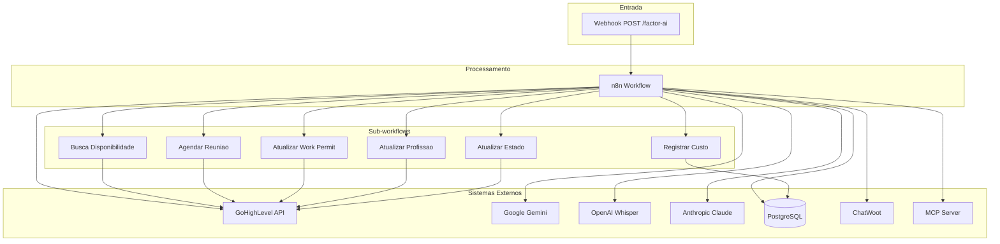

# 04 - INTEGRACOES EXTERNAS E APIs

**Workflow:** GHL - Mottivme - EUA Versionado
**Data de Analise:** 2025-12-31
**Agente Responsavel:** AGENTE 4 - Especialista em Integracoes e APIs

---

## 1. INVENTARIO DE INTEGRACOES

### Sistema 1: GoHighLevel (GHL) API

**Quantidade de chamadas:** 18 nos diretos + 5 tool workflows

#### Endpoint 1.1: GET /contacts/{contactId}
**No:** Search Contact (781bfd6b-aba2-4c1a-8c78-70d3534dc2cc)
**Metodo HTTP:** GET
**URL:** `https://services.leadconnectorhq.com/contacts/{{ $json.lead_id }}`

**Headers:**
```json
{
  "Authorization": "Bearer {{ $json.api_key }}",
  "Version": "2021-07-28"
}
```

**Request Body:** N/A (GET request)

**Response Esperado:**
```json
{
  "contact": {
    "id": "string",
    "firstName": "string",
    "lastName": "string",
    "email": "string",
    "phone": "string",
    "customFields": {},
    "tags": [],
    "locationId": "string"
  }
}
```

**Error Handling:**
- Retry? Sim
- Quantas tentativas? 3 (waitBetweenTries: 3000ms)
- Timeout: Padrao n8n
- Fallback: continueRegularOutput

**Rate Limiting:**
- Configurado? Nao explicitamente
- Limites conhecidos: GHL permite ~100 req/min por API key

**Proposito:** Buscar dados completos do contato para contexto do agente IA

---

#### Endpoint 1.2: POST /conversations/messages
**No:** Whatsapp (54980c5b-b84c-4c5b-91ab-72b32682a074)
**Metodo HTTP:** POST
**URL:** `https://services.leadconnectorhq.com/conversations/messages`

**Headers:**
```json
{
  "Authorization": "Bearer {{ $('Info').first().json.api_key }}",
  "Version": "2021-04-15"
}
```

**Request Body:**
```json
{
  "type": "SMS",
  "contactId": "{{ $('Info').first().json.lead_id }}",
  "message": "{{ $('Parser Chain').item.json.output.messages }}"
}
```

**Response Esperado:**
```json
{
  "conversationId": "string",
  "messageId": "string",
  "status": "delivered"
}
```

**Error Handling:**
- Retry? Sim (retryOnFail: true)
- Quantas tentativas? 3 (padrao)
- Timeout: Padrao n8n
- Fallback: Nenhum

**Proposito:** Enviar mensagens de resposta da IA via WhatsApp

---

#### Endpoint 1.3: POST /conversations/messages (Instagram)
**No:** Instagram (94639e3c-e072-4d2e-8242-33a1e58e5e4c)
**Metodo HTTP:** POST
**URL:** `https://services.leadconnectorhq.com/conversations/messages`

**Headers:**
```json
{
  "Authorization": "Bearer {{ $('Info').first().json.api_key }}",
  "Version": "2021-04-15"
}
```

**Request Body:**
```json
{
  "type": "IG",
  "contactId": "{{ $('Info').first().json.lead_id }}",
  "message": "{{ $('Parser Chain').item.json.output.messages }}"
}
```

**Error Handling:**
- Retry? Sim (retryOnFail: true)
- Fallback: Nenhum

**Proposito:** Enviar mensagens de resposta da IA via Instagram DM

---

#### Endpoint 1.4: PUT /contacts/{contactId}
**No:** Adicionar_tag_perdido (Tool - 5300e392-d22d-4bb0-aae6-97899a3352be)
**Metodo HTTP:** PUT
**URL:** `https://services.leadconnectorhq.com/contacts/{contact_Id}`

**Headers:**
```json
{
  "Authorization": "Bearer {{ $('Info').first().json.api_key }}",
  "Version": "2021-04-15"
}
```

**Request Body:**
```json
{
  "tags": ["perdido"]
}
```

**Proposito:** Desqualificar lead adicionando tag "perdido" - usado quando lead nao se enquadra no perfil

---

#### Endpoint 1.5: GET /locations/{locationId}/customFields
**No:** 1 Listar campos customizados (Node nao numerado)
**Metodo HTTP:** GET
**URL:** `https://services.leadconnectorhq.com/locations/{{ $('Info').first().json.location_id }}/customFields`

**Headers:**
```json
{
  "Authorization": "Bearer {{ $('Info').first().json.api_key }}",
  "Version": "2021-07-28"
}
```

**Proposito:** Listar todos os custom fields da location para mapeamento dinamico

---

#### Endpoint 1.6: PUT /contacts/{contactId} - Atualizar Custom Fields
**No:** Update Contact (Outbound) (HTTP Request Node)
**Metodo HTTP:** PUT
**URL:** `https://services.leadconnectorhq.com/contacts/{{ $('Info').first().json.lead_id }}`

**Headers:**
```json
{
  "Authorization": "Bearer {{ $('Info').first().json.api_key }}",
  "Version": "2021-04-15",
  "Content-Type": "application/json"
}
```

**Request Body (Exemplo - Ativar IA):**
```json
{
  "customFields": [
    {
      "id": "{{ $json.ativar_ia_id }}",
      "value": "sim"
    }
  ]
}
```

**Request Body (Exemplo - Carreira):**
```json
{
  "customFields": [
    {
      "id": "{{ $json.especialista_motive_id }}",
      "value": "sdrcarreira"
    },
    {
      "id": "{{ $json.objetivo_lead_id }}",
      "value": "carreira"
    },
    {
      "id": "{{ $json.ativar_ia_id }}",
      "value": "sim"
    }
  ]
}
```

**Proposito:** Atualizar campos customizados do contato (objetivo, especialista, ativar_ia)

---

#### Endpoint 1.7: GET /conversations/search
**No:** Buscar Conversa (HTTP Request Node)
**Metodo HTTP:** GET
**URL:** `https://services.leadconnectorhq.com/conversations/search?contactId={{ $('Info').first().json.lead_id }}&limit=1`

**Headers:**
```json
{
  "Authorization": "Bearer {{ $('Info').first().json.api_key }}",
  "Version": "2021-04-15"
}
```

**Proposito:** Buscar conversas do contato para contexto

---

#### Endpoint 1.8: POST /locations/{locationId}/customFields
**No:** GHL - Criar Campo Etapa do Funil (c95162d2-5fd9-4fb2-bf20-00545dfbe518)
**Status:** DESABILITADO
**Metodo HTTP:** POST
**URL:** `https://services.leadconnectorhq.com/locations/{{ $json.location.id }}/customFields`

**Request Body:**
```json
{
  "name": "Etapa do Funil",
  "fieldKey": "contact.etapa_funil",
  "dataType": "SINGLE_OPTIONS",
  "placeholder": "Selecione a etapa",
  "position": 100,
  "options": [
    "Novo Lead",
    "Primeiro Contato",
    "Em Follow-Up",
    "Qualificado",
    "Agendamento Marcado",
    "Reagendado",
    "No-Show",
    "Reuniao Realizada",
    "Proposta Enviada",
    "Follow-Up Proposta",
    "Contrato Enviado",
    "Aguardando Pagamento",
    "Cliente Ativo",
    "Perdido"
  ]
}
```

**Proposito:** Criar campo de etapa do funil (atualmente desabilitado)

---

### Sistema 2: Google Gemini API

**Quantidade de chamadas:** 3 nos

#### Endpoint 2.1: Chat Completion (Gemini 2.5 Pro)
**No:** Gemini2 (272f0f06-a636-4735-ba4c-89fc89970bcb)
**Tipo:** @n8n/n8n-nodes-langchain.lmChatGoogleGemini
**Modelo:** models/gemini-2.5-pro

**Credenciais:**
```json
{
  "googlePalmApi": {
    "id": "4ut0CD80SN7lbITM",
    "name": "Google Gemini(PaLM) Api account"
  }
}
```

**Error Handling:**
- Retry? Padrao n8n
- Fallback: Nenhum

**Proposito:** LLM principal para geracao de respostas do agente IA

---

#### Endpoint 2.2: Chat Completion (Parser Chain)
**No:** Google Gemini Chat Model2 (e999e99e-dc8b-4bec-b211-16bd02f666ae)
**Tipo:** @n8n/n8n-nodes-langchain.lmChatGoogleGemini

**Proposito:** Formatacao de mensagens para WhatsApp/Instagram (split de mensagens longas)

---

### Sistema 3: OpenAI API

**Quantidade de chamadas:** 1 no

#### Endpoint 3.1: Audio Transcription (Whisper)
**No:** Transcrever audio (5d2f835b-0299-47c3-a49a-663963ba883f)
**Tipo:** @n8n/n8n-nodes-langchain.openAi
**Operacao:** audio.transcribe

**Credenciais:**
```json
{
  "openAiApi": {
    "id": "WEENPovt22LUaeRp",
    "name": "OpenAi - Marcos"
  }
}
```

**Opcoes:**
```json
{
  "language": "pt"
}
```

**Proposito:** Transcrever mensagens de audio recebidas dos leads

---

### Sistema 4: Anthropic Claude API

**Quantidade de chamadas:** 1 no

#### Endpoint 4.1: Image Analysis
**No:** Analyze image (cfd76a6c-b2d4-4fa4-854f-da6647f6a627)
**Tipo:** @n8n/n8n-nodes-langchain.anthropic
**Modelo:** claude-sonnet-4-5-20250929

**Credenciais:**
```json
{
  "anthropicApi": {
    "id": "nNkFTZpNoiBCbO1I",
    "name": "Anthropic account"
  }
}
```

**Parametros:**
```json
{
  "resource": "image",
  "text": "O que ha nessa imagem?",
  "imageUrls": "{{ $json.photo_audio }}"
}
```

**Proposito:** Analisar imagens enviadas pelos leads

---

### Sistema 5: PostgreSQL (Supabase)

**Quantidade de chamadas:** 20+ nos

**Credenciais Principais:**
```json
{
  "postgres": {
    "id": "w2mBaRwhZ3tM4FUw",
    "name": "Postgres Marcos Daniels."
  }
}
```

**Credenciais Secundarias:**
```json
{
  "postgres": {
    "id": "B0fAAM3acruSSuiz",
    "name": "Postgres account"
  }
}
```

#### Tabelas Utilizadas:

| Tabela | Operacoes | Proposito |
|--------|-----------|-----------|
| `execution_metrics` | INSERT | Rastreio de execucoes |
| `n8n_fila_mensagens` | INSERT, SELECT, DELETE | Fila de mensagens encavaladas |
| `n8n_active_conversation` | SELECT, INSERT, UPDATE, DELETE | Controle de conversas ativas |
| `n8n_historico_mensagens` | SELECT, INSERT, DELETE | Memoria de conversas (LangChain) |
| `crm_historico_mensagens` | INSERT | Historico de mensagens do CRM |
| `ops_schedule_tracking` | INSERT/UPSERT | Tracking de operacoes |
| `n8n_schedule_tracking` | INSERT/UPSERT | Tracking de agendamentos |
| `agent_versions` | SELECT | Versoes de agentes ativos |
| `locations` | SELECT | Configuracoes de locations |

**Detalhamento das Queries Principais:**

##### Query: Buscar Mensagens na Fila
```sql
SELECT * FROM n8n_fila_mensagens
WHERE lead_id = '{{ $json.lead_id }}'
ORDER BY timestamp ASC
```

##### Query: Inserir Metrica de Execucao
```sql
INSERT INTO execution_metrics (
  execution_id, workflow_id, workflow_name, workflow_version,
  n8n_version, environment, status, started_at, owner_id
) VALUES ($1, $2, $3, $4, $5, $6, $7, NOW(), $8)
RETURNING *;
```

##### Query: Buscar Agente Ativo
```sql
SELECT av.*, l.api_key as location_api_key
FROM agent_versions av
LEFT JOIN locations l ON av.location_id = l.location_id
WHERE av.location_id = 'cd1uyzpJox6XPt4Vct8Y'
  AND av.is_active = true
  AND av.status = 'active'
ORDER BY av.activated_at DESC
LIMIT 1
```

##### Query: Buscar Historico de Mensagens
```sql
SELECT * FROM n8n_historico_mensagens
WHERE session_id = '{{ $json.lead_id }}'
ORDER BY created_at ASC
```

---

### Sistema 6: ChatWoot API

**Quantidade de chamadas:** 1 no

#### Endpoint 6.1: Download de Media
**No:** Download audio (3ab2663c-e9ba-4a33-82ab-237143e965e9)
**Tipo:** httpRequest com autenticacao ChatWoot

**Credenciais:**
```json
{
  "chatwootApi": {
    "id": "UmVE5jAScA8a8vNB",
    "name": "ChatWoot account"
  }
}
```

**URL:** `{{ $json.photo_audio }}`

**Error Handling:**
- Retry? Sim
- Fallback: continueRegularOutput

**Proposito:** Download de arquivos de audio para transcricao

---

### Sistema 7: MCP (Model Context Protocol)

**Quantidade de chamadas:** 1 no

#### Endpoint 7.1: Busca Historias
**No:** Busca historias (339a6530-f97d-4798-a6df-fb950b33f2d9)
**Tipo:** @n8n/n8n-nodes-langchain.mcpClientTool

**Parametros:**
```json
{
  "sseEndpoint": "https://cliente-a1.mentorfy.io/mcp/busca_historias/sse",
  "options": {
    "timeout": 60000
  }
}
```

**Error Handling:**
- Retry? Sim
- Wait Between Tries: 3000ms

**Proposito:** Buscar historias de sucesso/contexto personalizado via MCP

---

### Sistema 8: Tool Workflows (Sub-workflows)

**Quantidade de tools:** 5 tool workflows

#### Tool 8.1: Busca_disponibilidade
**No:** 08955562-d895-4f09-a959-18b6c3bfef00
**Workflow ID:** pZIcRI1PGMzbQHZZ
**Nome:** [ GHL ] Busca Disponibilidade

**Parametros:**
```json
{
  "calendar": "ID do calendario",
  "API_KEY": "API Key do GHL",
  "startDate": "1735689600000 (timestamp)",
  "endDate": "1736294400000 (timestamp)",
  "lead_id": "ID do lead",
  "usuario_responsavel": "ID do usuario"
}
```

**Proposito:** Buscar horarios disponiveis nos calendarios do GHL

---

#### Tool 8.2: Agendar_reuniao
**No:** 8f08715b-91f8-416d-bbaa-75e2636d1a6c
**Workflow ID:** u1UsmjNNpaEiwIsp
**Nome:** Agendar pelo GHL - ATUALIZAR KOMMO

**Parametros:**
```json
{
  "API_KEY": "string",
  "email": "string",
  "telefone": "string",
  "location_id": "string",
  "calendar_id": "string",
  "startTime": "2021-06-23T03:30:00+05:30",
  "firstName": "string",
  "lastName": "string",
  "lead_id": "string",
  "Carreira_Consultoria": "carreira|consultoria",
  "usuario_responsavel": "string"
}
```

**Proposito:** Criar agendamentos no GHL e atualizar Kommo

---

#### Tool 8.3: Atualizar Work Permit
**No:** 3cfa78ca-068b-466b-a0c9-744c2eb3d111
**Workflow ID:** 3Dd8d5AnpD4iLPwG
**Nome:** Atualizar Work Permit GHL (Otimizado)

**Parametros:**
```json
{
  "location_id": "string",
  "API_KEY": "string",
  "contact_id": "string",
  "workPermitValue": "Sim|Nao"
}
```

**Proposito:** Atualizar campo de work permit do contato

---

#### Tool 8.4: Atualizar Profissao
**No:** cf78c90c-dc4a-4b70-99b2-bb600309bb6f
**Workflow ID:** Kq3b79P6v4rTsiaH
**Nome:** Atualizar Campo Profissao GHL (Auto-Config)

**Parametros:**
```json
{
  "API_KEY": "string",
  "location_id": "string",
  "contact_id": "string",
  "profissaoValue": "string (texto livre)"
}
```

**Proposito:** Atualizar profissao/ocupacao do lead

---

#### Tool 8.5: Atualizar Estado
**No:** 51bd7052-50e4-4537-a9b4-77d160743ea6
**Workflow ID:** wsQQYmx8CLNBHoWq
**Nome:** Atualizar Estado GHL (Otimizado)

**Parametros:**
```json
{
  "API_KEY": "string",
  "estadoValue": "Florida|California|Texas|etc",
  "contact_id": "string",
  "location_id": "string"
}
```

**Proposito:** Atualizar estado onde o lead mora (EUA)

---

#### Tool 8.6: Registrar Custo IA
**No:** Call Track AI Cost (3124778a-2ba5-4aaf-a038-c8da82371a9d)
**Workflow ID:** GWKl5KuXAdeu4BLr
**Nome:** [TOOL] Registrar Custo IA

**Parametros:**
```json
{
  "location_id": "string",
  "location_name": "string",
  "contact_id": "string",
  "contact_name": "string",
  "canal": "whatsapp|instagram",
  "tipo_acao": "Agendar|Qualificar|etc",
  "total_tokens": "number",
  "output_tokens": "number",
  "model": "gemini-2.5-pro+flash",
  "input_tokens": "number",
  "workflowId": "string",
  "executionId": "string",
  "date": "ISO timestamp"
}
```

**Proposito:** Registrar custos de uso de LLM por execucao

---

## 2. MATRIZ DE INTEGRACOES

| Sistema | Endpoints | Autenticacao | Retry | Criticidade |
|---------|-----------|--------------|-------|-------------|
| GoHighLevel | 8+ | Bearer Token (API Key) | Sim | CRITICA |
| PostgreSQL | 20+ | Credenciais armazenadas | Sim | CRITICA |
| Google Gemini | 3 | API Key | Padrao | ALTA |
| OpenAI | 1 | API Key | Padrao | MEDIA |
| Anthropic | 1 | API Key | Padrao | MEDIA |
| ChatWoot | 1 | API Key | Sim | BAIXA |
| MCP Server | 1 | SSE Endpoint | Sim | MEDIA |
| Tool Workflows | 5 | Interno n8n | N/A | ALTA |

---

## 3. FLUXO DE AUTENTICACAO

### GoHighLevel
- **Armazenamento:** API Key dinamica por location (vem do webhook)
- **Passagem:** Header `Authorization: Bearer {{ api_key }}`
- **Versao API:** Header `Version: 2021-04-15` ou `2021-07-28`
- **Renovacao:** Nao aplicavel (chave estatica por location)

### Google Gemini
- **Armazenamento:** Credencial n8n `googlePalmApi`
- **Passagem:** Automatico pelo no
- **ID:** 4ut0CD80SN7lbITM

### OpenAI
- **Armazenamento:** Credencial n8n `openAiApi`
- **Passagem:** Automatico pelo no
- **ID:** WEENPovt22LUaeRp

### Anthropic
- **Armazenamento:** Credencial n8n `anthropicApi`
- **Passagem:** Automatico pelo no
- **ID:** nNkFTZpNoiBCbO1I

### PostgreSQL
- **Armazenamento:** Credencial n8n `postgres`
- **Passagem:** Connection string
- **IDs:** w2mBaRwhZ3tM4FUw (principal), B0fAAM3acruSSuiz (secundario)

### ChatWoot
- **Armazenamento:** Credencial n8n `chatwootApi`
- **Passagem:** Automatico pelo no
- **ID:** UmVE5jAScA8a8vNB

---

## 4. DEPENDENCIAS EXTERNAS



---

## 5. ANALISE DE RESILIENCIA

### GoHighLevel API
- **SLA esperado:** < 500ms
- **Disponibilidade:** 99.9% (SLA GHL)
- **Impacto de falha:** CRITICO - Impossibilita envio de mensagens e atualizacao de contatos
- **Estrategia de recuperacao:**
  - Retry automatico (3 tentativas)
  - Wait entre tentativas: 3000ms
  - Fallback: continueRegularOutput em alguns nos

### PostgreSQL (Supabase)
- **SLA esperado:** < 100ms
- **Disponibilidade:** 99.99% (Supabase Pro)
- **Impacto de falha:** CRITICO - Perda de memoria, estado e metricas
- **Estrategia de recuperacao:**
  - Retry automatico em nos criticos
  - alwaysOutputData em nos de leitura
  - onError: continueRegularOutput

### Google Gemini
- **SLA esperado:** 2-10s (dependendo do prompt)
- **Disponibilidade:** 99.9%
- **Impacto de falha:** ALTO - Nao gera resposta da IA
- **Estrategia de recuperacao:**
  - Retry padrao n8n
  - Nenhum fallback para outro LLM

### OpenAI Whisper
- **SLA esperado:** 2-5s
- **Disponibilidade:** 99.9%
- **Impacto de falha:** MEDIO - Audios nao sao transcritos
- **Estrategia de recuperacao:**
  - Continua com mensagem original "Arquivo de Audio"

### Anthropic Claude
- **SLA esperado:** 2-8s
- **Disponibilidade:** 99.9%
- **Impacto de falha:** MEDIO - Imagens nao sao analisadas
- **Estrategia de recuperacao:**
  - Continua com mensagem original

---

## 6. WEBHOOKS RECEBIDOS

| Webhook Path | Metodo | Origem | Payload Schema |
|--------------|--------|--------|----------------|
| `/factor-ai` | POST | GoHighLevel Workflow | Ver abaixo |

### Schema do Webhook Principal

```json
{
  "contact_id": "string",
  "first_name": "string",
  "full_name": "string",
  "email": "string",
  "phone": "string",
  "tags": "string (comma-separated)",
  "country": "string",
  "location": {
    "name": "string",
    "id": "string",
    "city": "string",
    "state": "string"
  },
  "message": {
    "type": "number",
    "body": "string"
  },
  "customData": {
    "ID": "string",
    "message": "string",
    "ghl_api_key": "string",
    "timezone": "string",
    "calendar_id_carreira": "string",
    "consultoria_financeira": "string",
    "photo_audio": "string (URL)",
    "work_permit": "string",
    "motive": "string",
    "objetivodolead": "string",
    "ativar_ia": "string"
  }
}
```

### Webhooks Internos (Wait Nodes)

| Webhook ID | No | Tempo |
|------------|-----|-------|
| 67355af6-0306-4b13-a57e-a5f53e8a9790 | Esperar | 18s |
| 389b1db5-6082-4683-aa47-d868d578e5ec | Wait | 15s |
| bbd4d6aa-da37-4ced-b768-193d47782b1b | 1.5s | 1.5s |

---

## 7. WEBHOOKS ENVIADOS

| Destino | Evento que Dispara | Payload |
|---------|-------------------|---------|
| GoHighLevel /conversations/messages | Resposta da IA processada | `{type, contactId, message}` |
| GoHighLevel /contacts/{id} | Atualizacao de dados | `{customFields, tags}` |

---

## 8. RATE LIMITING E QUOTAS

| Sistema | Limite Conhecido | Estrategia de Controle |
|---------|------------------|------------------------|
| GoHighLevel | ~100 req/min por API key | Retry com backoff |
| Google Gemini | 60 RPM (Free) / 1000 RPM (Paid) | Nenhum controle explicito |
| OpenAI | 3 RPM (Free) / 60 RPM (Paid) | Nenhum controle explicito |
| Anthropic | 40 RPM | Nenhum controle explicito |
| PostgreSQL | N/A (connection pooling) | Connection pooling |

### Estrategias de Controle Implementadas:

1. **Wait Node (18s):** Delay para evitar processamento de mensagens encavaladas
2. **Split in Batches (1.5s):** Delay entre envios de mensagens segmentadas
3. **Retry on Fail:** Tentativas automaticas em caso de erro
4. **Continue Regular Output:** Ignora erros em nos nao criticos

---

## 9. SEGURANCA E BOAS PRATICAS

### Pontos Positivos:
- API Keys dinamicas por location (nao hardcoded)
- Credenciais armazenadas no n8n credential store
- Bearer token authentication para GHL

### Pontos de Atencao:
- Nenhum rate limiting explicito para LLMs
- Sem circuit breaker implementado
- Logs de erro nao persistidos em sistema externo
- Nenhuma validacao de input no webhook

### Recomendacoes:
1. Implementar rate limiting para chamadas a LLMs
2. Adicionar circuit breaker para sistemas externos
3. Persistir logs de erro no Postgres
4. Validar schema do webhook na entrada
5. Implementar fallback entre LLMs (Gemini -> OpenAI)

---

## 10. CUSTOS ESTIMADOS

### Por Execucao (baseado em calculo do workflow):

| LLM | Tokens Input | Tokens Output | Custo USD |
|-----|--------------|---------------|-----------|
| Gemini 2.5 Pro | ~10,050 | Variavel | ~$0.01-0.05 |
| Gemini 2.5 Flash | Variavel | Variavel | ~$0.001-0.01 |

### Formula de Custo (Code Node):
```javascript
const PRECO_INPUT = 1.25;  // USD por 1M tokens
const PRECO_OUTPUT = 5.00; // USD por 1M tokens

const custoInput = (promptTokens / 1000000) * PRECO_INPUT;
const custoOutput = (completionTokens / 1000000) * PRECO_OUTPUT;
const custoTotal = custoInput + custoOutput;
```

---

*Documento gerado pelo Agente 4 - Especialista em Integracoes e APIs*
*Versao: 1.0*
*Data: 2025-12-31*
