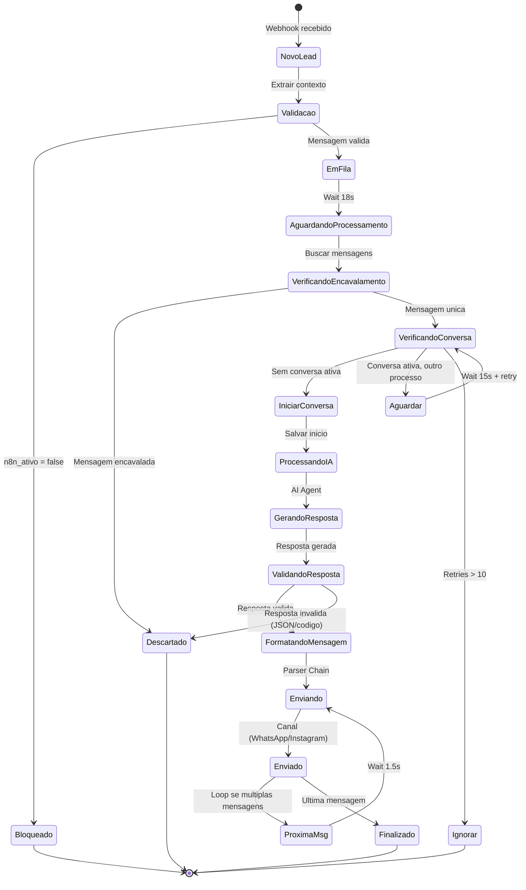

# 05 - LOGICA DE NEGOCIO E REGRAS

**Workflow:** GHL - Mottivme - EUA Versionado
**Tipo:** Sistema de Atendimento com IA para Leads do Mercado EUA
**Data de Analise:** 2025-12-31

---

## 1. MAQUINA DE ESTADOS

### Estados Identificados

| Estado | Descricao | Condicao de Entrada |
|--------|-----------|---------------------|
| **Novo Lead** | Lead acabou de enviar primeira mensagem | Webhook recebido, sem historico |
| **Em Fila** | Mensagem enfileirada aguardando processamento | Multiplas mensagens enviadas em sequencia |
| **Aguardando IA** | Conversa ativa, IA processando | `status === 'active'` na tabela `n8n_active_conversation` |
| **Processando** | IA gerando resposta | Apos `Salvar Inicio IA` |
| **Respondendo** | Enviando mensagem ao lead | Apos `Parser Chain` |
| **Inativo** | Conversa finalizada/pausada | `status === 'inactive'` ou timeout > 1 minuto |
| **Bloqueado** | IA desativada para este lead | `n8n_ativo === false` |
| **Perdido** | Lead desqualificado | Tag "perdido" adicionada |

### Transicoes de Estado



---

## 2. REGRAS CONDICIONAIS

### Regra 1: "Ativar IA"
**No:** Ativar IA (ID: 843943ea-7ec3-4b47-a662-6046beea4ae5)
**Tipo:** If
**Condicao:**
```javascript
// Condicao 1 (OR)
$json.ativar_ia === 'sim'

// Condicao 2 (OR)
$json.etiquetas.includes('assistente-admin')
```

**Rotas:**
- TRUE: -> No "Tipo de mensagem" (processa mensagem)
- FALSE: -> Workflow termina (IA desativada)

**Proposito:** Controlar se a IA deve responder ao lead. Permite desativar IA para leads especificos ou ativar apenas para administradores.

**Impacto:** Se FALSE, o lead nao recebe resposta automatica da IA.

---

### Regra 2: "Tipo de Mensagem"
**No:** Tipo de mensagem (ID: 6737ad10-a146-4dde-99a4-39d256540f69)
**Tipo:** Switch (6 saidas)
**Condicoes:**

| Saida | Condicao | Destino |
|-------|----------|---------|
| `/reset` | `$('Info').item.json.mensagem.includes('/reset')` | Limpar memoria |
| `/teste` | `$('Info').item.json.mensagem.includes('/teste')` | Fluxo de teste |
| `Texto` | `tipo_mensagem_original === 'texto' && mensagem.length > 0` | Enfileirar mensagem |
| `Imagem` | `tipo_mensagem_original === 'imagem'` | Analyze image |
| `Audio` | `tipo_mensagem_original === 'audio'` | Download audio |
| `Vazia` | `tipo_mensagem_original === ''` | Descarta |

**Proposito:** Rotear o processamento baseado no tipo de conteudo recebido.

**Impacto:**
- Comandos `/reset` e `/teste` acionam fluxos administrativos
- Imagens sao analisadas por Claude Sonnet
- Audios sao transcritos por OpenAI Whisper
- Mensagens vazias sao ignoradas

---

### Regra 3: "Acao Planejada"
**No:** Acao Planejada (ID: 8555b95c-6398-4df7-ac36-a77b34c31448)
**Tipo:** Switch (3 saidas)
**Condicoes:**

```javascript
// Saida 1: "Iniciar Conversa"
$json.isEmpty() ||
$json.status === 'inactive' ||
(new Date() - new Date($json.created_at)) > 1 * 60 * 1000

// Saida 2: "Ignorar"
$json.retries > 10 ||
($json.waiting_process_id &&
 $json.status === 'active' &&
 $json.waiting_process_id !== $('Info').item.json.process_id)

// Saida 3: "Aguardar"
$json.status === 'active'
```

**Rotas:**
- **Iniciar Conversa:** -> "Permitido AI?" -> Inicia processamento da IA
- **Ignorar:** -> Workflow termina (evita duplicacao)
- **Aguardar:** -> "Salvar Espera" -> Wait 15s -> Retry

**Proposito:** Controlar concorrencia entre multiplos processos tentando responder ao mesmo lead.

**Impacto:**
- Evita respostas duplicadas
- Implementa mecanismo de retry com limite de 10 tentativas
- Timeout de 1 minuto para considerar conversa inativa

---

### Regra 4: "Permitido AI?"
**No:** Permitido AI? (ID: 89380197-9a86-4270-a5c4-70a5f8c8853b)
**Tipo:** Filter
**Condicao:**
```javascript
// Ambas condicoes devem ser verdadeiras (AND)
$('Info').item.json.n8n_ativo !== false
&&
$('Tipo de mensagem').item.json.mensagem.toLowerCase() !== 'okkk'
```

**Rotas:**
- PASSA: -> "Execution Data" -> Processa IA
- BLOQUEADO: -> Workflow termina

**Proposito:** Dupla verificacao de permissao para IA responder.

**Impacto:** Mensagem "okkk" (confirmacao simples) nao aciona resposta da IA.

---

### Regra 5: "Canal de Envio"
**No:** Canal (ID: 020715bd-e226-418c-bdb9-3cc5379446bd)
**Tipo:** Switch
**Condicao:**
```javascript
// Saida 1: Whatsapp
'whatsapp ' === $('Info').first().json.source + ' '

// Saida 2: Instagram
'instagram' === $('Info').first().json.source
```

**Rotas:**
- **Whatsapp:** -> API GHL tipo "SMS"
- **Instagram:** -> API GHL tipo "IG"

**Proposito:** Rotear resposta para o canal correto de origem.

---

### Regra 6: "Validacao de Resposta IA"
**No:** If1 (ID: 2648a0cf-ca4f-474b-8667-30546c7d5ae5)
**Tipo:** If
**Condicao:**
```javascript
// Todas devem ser FALSE (resposta NAO contem termos tecnicos)
!$json.output.messages.join().toLowerCase().includes("json") &&
!$json.output.messages.join().toLowerCase().includes("{") &&
!$json.output.messages.join().toLowerCase().includes("output") &&
!$json.output.messages.join().toLowerCase().includes("parsed") &&
!$json.output.messages.join().toLowerCase().includes("split") &&
!$json.output.messages.join().toLowerCase().includes("properties") &&
!$json.output.messages.join().toLowerCase().includes("type")
```

**Rotas:**
- TRUE (resposta limpa): -> "Execution Data2" -> Enviar
- FALSE (resposta com codigo): -> "Parser Chain" para reformatacao

**Proposito:** Detectar e filtrar respostas que vazaram codigo/JSON para o usuario.

**Impacto:** Evita que leads recebam mensagens com codigo tecnico.

---

### Regra 7: "Verificar Resposta Valida"
**No:** If (sem nome, ID: 843943ea...) - "Output valido"
**Tipo:** If
**Condicao:**
```javascript
// Ambas devem ser verdadeiras
!$json.output.includes("<ctrl") &&
$json.output !== '' &&
$json.output !== undefined
```

**Rotas:**
- TRUE: -> "Filter" -> Continua processamento
- FALSE: -> Descarta resposta invalida

**Proposito:** Filtrar respostas vazias ou com caracteres de controle.

---

### Regra 8: "Filtro de Tamanho"
**No:** Filter (ID: b750bc68-0b49-4ccc-bc0e-5f40feb8abeb)
**Tipo:** Filter
**Condicao:**
```javascript
$json.output.length > 2
```

**Proposito:** Garantir que apenas respostas com conteudo significativo sejam enviadas.

---

### Regra 9: "Deve Enviar Mensagem?"
**No:** Deve enviar mensagem? (ID: c9be966e-1ef5-4c5f-8ea1-7050dd2840d5)
**Tipo:** Filter
**Condicao:**
```javascript
// Deve ser FALSE (nao ha outro processo esperando)
!($json.waiting_process_id &&
  $json.waiting_process_id !== $('Info').first().json.process_id)
```

**Proposito:** Evitar envio duplicado quando outro processo assumiu a conversa.

---

### Regra 10: "Ha Processo Aguardando?"
**No:** If (ID: 33dec01d-7e1a-4b95-9e37-500463e1ed2b)
**Tipo:** If
**Condicao:**
```javascript
$json.waiting_process_id !== '' &&
$json.waiting_process_id !== null
```

**Rotas:**
- TRUE (ha processo): -> "Atualizar resposta IA"
- FALSE (sem processo): -> "Termino de resposta"

**Proposito:** Decidir se deve atualizar registro ou finalizar.

---

### Regra 11: "Switch Objetivo (Carreira/Consultoria)"
**No:** 4 Switch Objetivo (ID: 97745add-33ee-493b-a963-79c78463b1ee)
**Tipo:** Switch
**Condicoes:**
```javascript
// Saida 1: Carreira
$json.resultado === 'carreira'

// Saida 2: Consultoria
$json.resultado === 'consultoria'

// Saida 3: Indefinido
$json.resultado === 'indefinido'
```

**Proposito:** Rotear leads para calendarios diferentes baseado no objetivo identificado.

**Impacto:** Define qual calendario sera usado para agendamento.

---

## 3. VALIDACOES DE DADOS

| Campo | Validacao | No | Acao se Invalido |
|-------|-----------|-----|------------------|
| `mensagem` | notEmpty | Tipo de mensagem | Saida "mensagem vazia" |
| `n8n_ativo` | !== false | Permitido AI? | Bloqueia processamento |
| `output.length` | > 2 | Filter | Descarta resposta |
| `output` | !includes("<ctrl") | If output valido | Descarta resposta |
| `output.messages` | !includes("json", "{", etc) | If1 | Reformata via Parser |
| `waiting_process_id` | match com process_id | Deve enviar mensagem? | Bloqueia envio |
| `retries` | <= 10 | Acao Planejada | Ignora (evita loop infinito) |
| `status` | 'active'/'inactive' | Acao Planejada | Decide acao |
| `source` | 'whatsapp'/'instagram' | Canal | Roteia para API correta |

---

## 4. REGRAS DE ROTEAMENTO

### Por Tipo de Mensagem
```
Texto -> Enfileirar -> Processar IA
Imagem -> Claude Vision -> Extrair descricao -> Processar IA
Audio -> Whisper -> Transcrever -> Processar IA
Comando /reset -> Limpar memoria -> Confirmar
Comando /teste -> Fluxo de teste -> Enviar mensagem
Vazia -> Ignorar
```

### Por Canal de Origem
```
WhatsApp -> API GHL tipo "SMS"
Instagram -> API GHL tipo "IG"
```

### Por Status do Lead
```
IA Ativada (ativar_ia = 'sim') -> Processar
IA Desativada (ativar_ia != 'sim') -> Ignorar
Tag 'assistente-admin' -> Processar sempre
```

### Por Estado da Conversa
```
Sem conversa ativa -> Iniciar nova conversa
Conversa ativa (mesmo processo) -> Continuar
Conversa ativa (outro processo) -> Aguardar 15s + retry
Retries > 10 -> Ignorar (deadlock prevention)
Conversa inativa > 1 min -> Iniciar nova
```

---

## 5. LOGICA DE RETRY E TIMEOUT

### Estrategia de Retry 1: Mensagens Encavaladas
**Onde:** No "Esperar" -> "Buscar mensagens" -> "Mensagem encavalada?"
**Condicao para retry:** Usuario envia multiplas mensagens em sequencia
**Tempo de espera inicial:** 18 segundos
**Acao apos espera:** Busca todas as mensagens e processa a ultima
**Objetivo:** Consolidar multiplas mensagens antes de responder

### Estrategia de Retry 2: Conversa Ativa
**Onde:** No "Acao Planejada" -> "Salvar Espera" -> "Wait"
**Condicao para retry:** Outro processo esta respondendo ao mesmo lead
**Intervalo entre tentativas:** 15 segundos
**Maximo de tentativas:** 10
**Acao apos maximo:** Ignora mensagem (evita loop infinito)

### Estrategia de Retry 3: Envio de Mensagens
**Onde:** Nos HTTP Request (Whatsapp, Instagram)
**Condicao:** `retryOnFail: true`
**Intervalo padrao n8n:** Exponential backoff
**Acao apos falha:** Tenta novamente automaticamente

### Timeout de Conversa
**Onde:** Verificacao em "Acao Planejada"
**Condicao:** `(new Date() - new Date($json.created_at)) > 1 * 60 * 1000`
**Tempo:** 1 minuto
**Acao:** Considera conversa como inativa, inicia nova

---

## 6. CALCULOS E TRANSFORMACOES

### Calculo 1: "Verificacao de Mensagem Encavalada"
**No:** Mensagem encavalada? (ID: 0c9429d0-203b-4d6f-9612-05a13060c3e8)
**Input:**
```javascript
{
  ultima_mensagem_da_fila: Object, // Ultima mensagem do banco
  mensagem_do_workflow: string     // ID da mensagem atual
}
```

**Logica:**
```javascript
const ultima_mensagem_da_fila = $('Buscar mensagens').last();
const mensagem_do_workflow = $('Info').first().json.mensagem_id;

// Parsear o JSON string
let last_db = null;
try {
  last_db = JSON.parse(ultima_mensagem_da_fila.json.last_db_message);
} catch(e) {
  last_db = null;
}

// Se a ultima mensagem no banco NAO e a mensagem atual, para o workflow
if (last_db && last_db.id_mensagem !== mensagem_do_workflow) {
  return []; // Mensagem encavalada, para o workflow
}

// Pass-through da fila de mensagens
return $('Buscar mensagens').all();
```

**Output:** Array de mensagens para processar ou array vazio (para workflow)

---

### Calculo 2: "Deduplicacao de Mensagens"
**No:** Deduplica Mensagens (ID: d274f5c1-94fb-4dbf-ba77-e83025bc6f0f)
**Input:**
```javascript
{
  allMessages: Array,    // Todas mensagens do historico
  mensagemAtual: string  // Mensagem atual do lead
}
```

**Logica:**
```javascript
const allMessages = $('Mensagem anteriores').all();

// Transforma todos os items em um array de mensagens
const msgArray = allMessages
  .map(item => item.json)
  .filter(item => {
    return item && item.created_at && item.message && item.message.content;
  });

// Adiciona a mensagem ATUAL do lead ao historico
const mensagemAtual = infoData.mensagem;
if (mensagemAtual && mensagemAtual.trim()) {
  msgArray.push({
    created_at: new Date().toISOString(),
    message: {
      type: "human",
      content: mensagemAtual
    }
  });
}

// Deduplica por timestamp + conteudo
const seen = new Map();
const unique = msgArray.filter(item => {
  const timestamp = new Date(item.created_at).getTime();
  const content = item.message?.content || '';
  const key = `${timestamp}_${content.substring(0, 100)}`;

  if (seen.has(key)) {
    return false; // Duplicata
  }

  seen.set(key, true);
  return true;
});

// Formata as mensagens em ordem cronologica
const mensagens_antigas = unique
  .sort((a, b) => new Date(a.created_at) - new Date(b.created_at))
  .map(item => {
    const prefix = item.message.type === "human" ? "Lead/Humano" : "Assistente/IA";
    return `[${item.created_at}] ${prefix}: ${content}`;
  })
  .join("\n\n");
```

**Output:** String formatada com historico de mensagens deduplicado

---

### Calculo 3: "Preparar Mensagem para Memoria"
**No:** Preparar Mensagem (ID: 83d94181-776a-43e5-bb20-d54c65d8b7f5)
**Input:**
```javascript
{
  mensagem: string  // Mensagem original do lead
}
```

**Logica:**
```javascript
const info = $('Info').first().json;
const mensagem = info.mensagem || '';

// Sanitiza quebras de linha
const mensagemLimpa = mensagem
  .trim()
  .replace(/\r\n/g, '\n')
  .replace(/\r/g, '\n');

// Retorna o OBJETO para inserir no banco
return [{
  json: {
    lead_id: info.lead_id,
    session_id: info.lead_id,
    message: {
      type: "human",
      content: mensagemLimpa,
      tool_calls: [],
      additional_kwargs: {},
      response_metadata: {},
      invalid_tool_calls: []
    }
  }
}];
```

**Output:** Objeto JSON no formato LangChain para persistencia

---

### Calculo 4: "Janela de Tempo para Disponibilidade"
**No:** Code (ID na posicao 4574)
**Input:**
```javascript
{
  // Dados do input anterior
}
```

**Logica:**
```javascript
const start = new Date();
const starttimeISO = start.toISOString();
const starttimeMs = start.getTime();

const end = new Date(start);
end.setDate(end.getDate() + 7); // 7 dias a frente
const endtimeISO = end.toISOString();
const endtimeMs = end.getTime();

return [{
  json: {
    ...inputData,
    starttimeISO,
    starttimeMs,
    endtimeISO,
    endtimeMs
  }
}];
```

**Output:** Objeto com timestamps de inicio e fim para busca de disponibilidade

---

### Calculo 5: "Extrair ID de Conversa"
**No:** Code (ID na posicao 3402)
**Logica:**
```javascript
const data = $input.first().json;

if (data.conversations && data.conversations.length > 0) {
  const conversationId = data.conversations[0].id;

  return [{
    json: {
      conversationId: conversationId,
      contactId: $input.first().json.body?.contact_id || data.conversations[0].contactId
    }
  }];
}

// Se nao encontrar conversa, retorna vazio
return [];
```

**Output:** ID da conversa para uso no GHL

---

## 7. REGRAS DE AGENDAMENTO

### Quando Follow-ups Sao Criados
- **Agendamento confirmado:** Task criada no GHL via workflow externo
- **No-show:** Reagendamento automatico sugerido pela IA
- **Lead qualificado sem horario:** IA oferece opcoes de horarios

### Como Prioridades Sao Definidas
| Situacao | Prioridade |
|----------|------------|
| Lead novo com work permit | Alta (consultoria imediata) |
| Lead novo sem work permit | Media (avaliacao de carreira) |
| Reagendamento | Alta |
| Follow-up pos-reuniao | Media |

### Logica de Tipo de Calendario
```javascript
// Baseado no work permit do lead
if (workPermit === 'sim' || workPermit === 'yes') {
  calendario = 'calendarID_consultoria';
} else {
  calendario = 'calendarID_carreira';
}
```

### Busca de Disponibilidade
- **Janela:** 7 dias a partir de hoje
- **Formato:** Timestamps em milissegundos
- **API:** GHL Calendar Slots

---

## 8. REGRAS DE ESCALACAO

### Quando Escalar para Humano
| Trigger | Condicao | Acao |
|---------|----------|------|
| Tag "perdido" | Lead desqualificado | IA adiciona tag, humano revisa |
| Comando admin | `/teste` ou `/reset` | Fluxo administrativo |
| IA bloqueada | `n8n_ativo = false` | Mensagem nao processada |
| Erro de API | Falha no envio | Retry automatico, log para analise |

### Criterios de Desqualificacao (Tag "perdido")
1. Lead ja e cliente cadastrado
2. Lead e agente/concorrente
3. Lead mora no Brasil (fora do mercado EUA)
4. Lead sem interesse declarado
5. Lead insatisfeito/hostil

### Como Humano e Notificado
- Tags adicionadas no GHL disparam automacoes
- Leads desqualificados aparecem em pipeline especifico
- Notificacoes via CRM GoHighLevel

---

## 9. BUSINESS RULES DOCUMENTATION

### RN-001: Controle de Concorrencia
**Descricao:** Apenas um processo pode responder a um lead por vez
**Razao de Negocio:** Evitar respostas duplicadas e confusao do lead
**Condicoes:** Sempre que uma mensagem e recebida
**Excecoes:** Nenhuma
**Implementacao:**
- Tabela `n8n_active_conversation` com status/waiting_process_id
- No "Acao Planejada" (ID: 8555b95c-6398-4df7-ac36-a77b34c31448)

---

### RN-002: Consolidacao de Mensagens
**Descricao:** Esperar 18s antes de processar para consolidar mensagens rapidas
**Razao de Negocio:** Leads frequentemente enviam multiplas mensagens seguidas
**Condicoes:** Toda mensagem de texto
**Excecoes:** Comandos administrativos (/reset, /teste)
**Implementacao:**
- Tabela `n8n_fila_mensagens`
- No "Esperar" (18s) -> "Buscar mensagens"

---

### RN-003: Filtragem de Respostas Tecnicas
**Descricao:** Bloquear envio de respostas com codigo/JSON
**Razao de Negocio:** Leads nao devem receber conteudo tecnico
**Condicoes:** Resposta contem termos: json, {, output, parsed, split, properties, type
**Excecoes:** Nenhuma
**Implementacao:** No "If1" (ID: 2648a0cf-ca4f-474b-8667-30546c7d5ae5)

---

### RN-004: Roteamento por Canal
**Descricao:** Resposta deve ser enviada pelo mesmo canal de origem
**Razao de Negocio:** Manter contexto da conversa
**Condicoes:** Campo `source` do lead
**Excecoes:** Nenhuma
**Implementacao:** No "Canal" (ID: 020715bd-e226-418c-bdb9-3cc5379446bd)

---

### RN-005: Limite de Retries
**Descricao:** Maximo de 10 tentativas de processar mesma mensagem
**Razao de Negocio:** Evitar loops infinitos e consumo excessivo de recursos
**Condicoes:** Campo `retries` na tabela `n8n_active_conversation`
**Excecoes:** Nenhuma
**Implementacao:** No "Acao Planejada" (retries > 10 -> Ignorar)

---

### RN-006: Timeout de Conversa
**Descricao:** Conversa considerada inativa apos 1 minuto
**Razao de Negocio:** Liberar lock para novos processamentos
**Condicoes:** `(new Date() - created_at) > 60000ms`
**Excecoes:** Nenhuma
**Implementacao:** No "Acao Planejada" (primeira condicao do switch)

---

### RN-007: Processamento de Midia
**Descricao:** Imagens e audios sao convertidos em texto antes do processamento
**Razao de Negocio:** IA precisa de contexto textual para responder
**Condicoes:** `tipo_mensagem_original` = 'imagem' ou 'audio'
**Excecoes:** Nenhuma
**Implementacao:**
- Imagens: Claude Sonnet Vision
- Audios: OpenAI Whisper (pt)

---

### RN-008: Memoria de Conversa
**Descricao:** Historico de mensagens e mantido por session_id (lead_id)
**Razao de Negocio:** IA precisa de contexto para respostas coerentes
**Condicoes:** Toda conversa
**Excecoes:** Comando /reset limpa memoria
**Implementacao:**
- Tabela `n8n_historico_mensagens`
- Deduplicacao por timestamp + conteudo

---

### RN-009: Espacamento de Mensagens
**Descricao:** Intervalo de 1.5s entre mensagens multiplas
**Razao de Negocio:** Evitar rate limiting do WhatsApp/Instagram e melhorar UX
**Condicoes:** Resposta segmentada em multiplas mensagens
**Excecoes:** Nenhuma
**Implementacao:** No "1.5s" entre cada iteracao do Loop

---

### RN-010: Qualificacao por Objetivo
**Descricao:** Leads sao direcionados para consultoria ou carreira baseado no work permit
**Razao de Negocio:** Diferentes necessidades requerem diferentes abordagens
**Condicoes:** Campo `workPermitValue` do lead
**Excecoes:** Indefinido = precisa mais informacoes
**Implementacao:** No "4 Switch Objetivo"

---

## 10. DECISION TREE

```mermaid
graph TD
    Start[Webhook: Mensagem Recebida] --> UTM[Extrair Contexto UTM]
    UTM --> Ativar{IA Ativada?<br/>ativar_ia=sim OR<br/>tag=assistente-admin}

    Ativar -->|Nao| FIM1[Fim: IA Desativada]
    Ativar -->|Sim| TipoMsg{Tipo de<br/>Mensagem?}

    TipoMsg -->|/reset| Reset[Limpar Memoria]
    TipoMsg -->|/teste| Teste[Fluxo de Teste]
    TipoMsg -->|Vazia| FIM2[Fim: Ignorar]
    TipoMsg -->|Texto| Fila[Enfileirar Mensagem]
    TipoMsg -->|Imagem| Vision[Claude Vision]
    TipoMsg -->|Audio| Whisper[Transcrever Audio]

    Vision --> Fila2[Preparar para IA]
    Whisper --> Fila2

    Fila --> Espera[Wait 18s]
    Fila2 --> ConversaAtiva

    Espera --> BuscaMsg[Buscar Mensagens]
    BuscaMsg --> Encavalada{Mensagem<br/>Encavalada?}

    Encavalada -->|Sim| FIM3[Fim: Processar Ultima]
    Encavalada -->|Nao| LimpaFila[Limpar Fila]

    LimpaFila --> ConversaAtiva[Verificar Conversa Ativa]
    ConversaAtiva --> Acao{Status da<br/>Conversa?}

    Acao -->|Inativa/Nova| Permitido{n8n_ativo<br/>AND<br/>msg != okkk?}
    Acao -->|Retries > 10| FIM4[Fim: Limite de Retries]
    Acao -->|Ativa outro processo| Aguardar[Wait 15s + Retry]

    Aguardar --> ConversaAtiva

    Permitido -->|Nao| FIM5[Fim: IA Bloqueada]
    Permitido -->|Sim| SalvarInicio[Salvar Inicio IA]

    SalvarInicio --> PrepMsg[Preparar Mensagem]
    PrepMsg --> BuscaHist[Buscar Historico]
    BuscaHist --> Deduplica[Deduplica Mensagens]
    Deduplica --> SetMensagens[Formatar Contexto]

    SetMensagens --> AIAgent[AI Agent Gemini 2.5 Pro]
    AIAgent --> ValidaOutput{Output<br/>Valido?}

    ValidaOutput -->|Vazio ou Ctrl| FIM6[Fim: Resposta Invalida]
    ValidaOutput -->|OK| TamOutput{Tamanho > 2?}

    TamOutput -->|Nao| FIM7[Fim: Resposta Curta]
    TamOutput -->|Sim| ConversaAtual[Atualizar Conversa]

    ConversaAtual --> ProcessoEspera{Ha Processo<br/>Esperando?}

    ProcessoEspera -->|Sim| AtualizaResposta[Atualizar Resposta IA]
    ProcessoEspera -->|Nao| TerminoResposta[Terminar Conversa]

    AtualizaResposta --> DeveEnviar{Deve<br/>Enviar?}
    TerminoResposta --> DeveEnviar

    DeveEnviar -->|Nao| FIM8[Fim: Outro Processo Assumiu]
    DeveEnviar -->|Sim| ValidaTecnico{Contem<br/>Codigo/JSON?}

    ValidaTecnico -->|Sim| Parser[Parser Chain - Reformatar]
    ValidaTecnico -->|Nao| Segmenta[Segmentar Mensagens]

    Parser --> Segmenta
    Segmenta --> Loop[Loop: Para cada mensagem]

    Loop --> Canal{Canal<br/>de Origem?}

    Canal -->|WhatsApp| EnviaWA[API GHL tipo SMS]
    Canal -->|Instagram| EnviaIG[API GHL tipo IG]

    EnviaWA --> Wait15[Wait 1.5s]
    EnviaIG --> Wait15

    Wait15 --> ProximaMsg{Mais<br/>Mensagens?}
    ProximaMsg -->|Sim| Loop
    ProximaMsg -->|Nao| SalvaMemoria[Salvar Memoria IA]

    SalvaMemoria --> TrackCusto[Registrar Custo IA]
    TrackCusto --> FIM9[Fim: Sucesso]

    Reset --> EnviaConfirm[Envia: Memoria resetada]
    EnviaConfirm --> FIM10[Fim: Reset OK]

    Teste --> EnviaOK[Envia OK]
    EnviaOK --> FIM11[Fim: Teste OK]
```



---

## 11. FERRAMENTAS DA IA (AI TOOLS)

A IA possui acesso as seguintes ferramentas para executar acoes:

| Ferramenta | Descricao | Quando Usar |
|------------|-----------|-------------|
| `Adicionar_tag_perdido` | Adiciona tag "perdido" ao contato | Lead desqualificado |
| `Busca_disponibilidade` | Busca slots no calendario | Lead quer agendar |
| `Agendar_reuniao` | Cria agendamento | Lead confirmou horario |
| `Atualizar Work Permit` | Atualiza campo work permit | Lead informou status |
| `Atualizar Profissao` | Atualiza campo profissao | Lead informou profissao |
| `Atualizar Estado` | Atualiza estado onde mora | Lead informou estado |
| `Busca historias` | Busca historias de sucesso | Lead precisa de prova social |
| `Think` | Raciocinio interno da IA | Processar logica complexa |

---

## 12. GLOSSARIO DE TERMOS

| Termo | Definicao |
|-------|-----------|
| **Mensagem Encavalada** | Multiplas mensagens enviadas antes da IA responder |
| **Conversa Ativa** | Processo da IA em andamento para um lead |
| **waiting_process_id** | ID do processo que esta aguardando sua vez |
| **Work Permit** | Autorizacao de trabalho nos EUA |
| **Carreira** | Tipo de consultoria para quem NAO tem work permit |
| **Consultoria** | Tipo de servico para quem JA tem work permit |
| **Session ID** | Identificador da sessao = lead_id |
| **Parse/Parser** | Formatacao da resposta da IA para envio |

---

## 13. METRICAS E RASTREAMENTO

### Dados Salvos por Execucao
- `execution_id`: ID unico da execucao n8n
- `workflow_id`: ID do workflow
- `lead_id`: ID do lead no GHL
- `lead_name`: Nome do lead
- `location_id`: Sub-conta GHL
- `agente_ia`: Tipo de agente usado
- `a_lead_response`: Resposta enviada

### Custos de IA Rastreados
- `total_tokens`: Total de tokens consumidos
- `input_tokens`: Tokens de entrada
- `output_tokens`: Tokens de saida
- `model`: Modelo usado (gemini-2.5-pro+flash)

---

*Documento gerado automaticamente pela analise do workflow n8n.*
